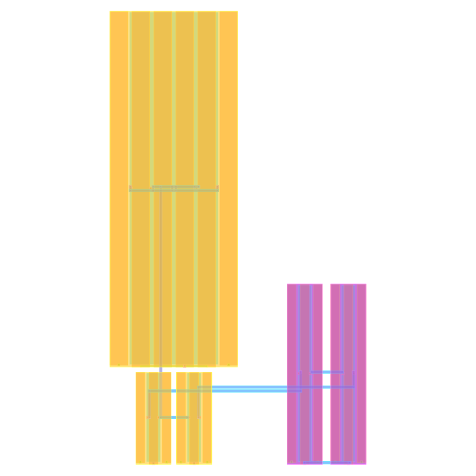
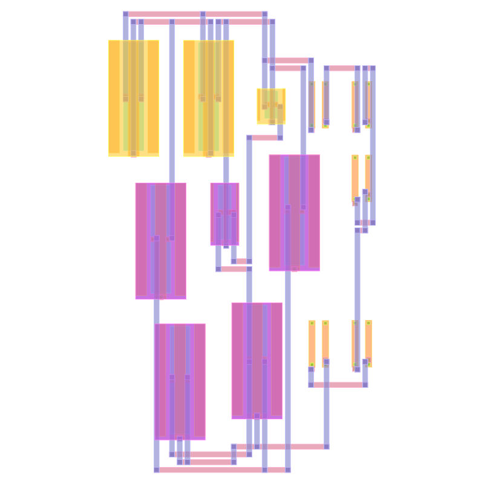
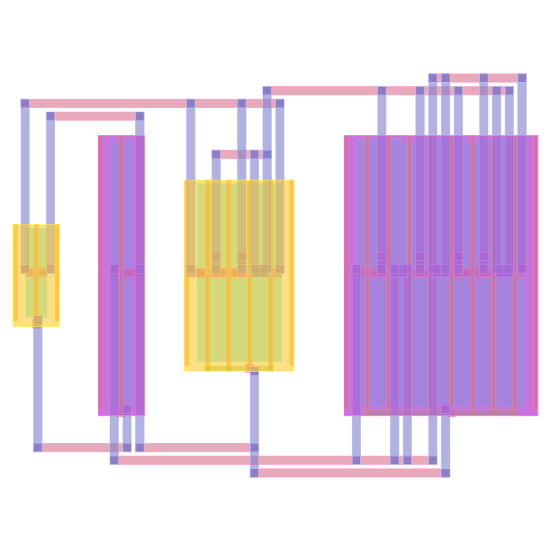
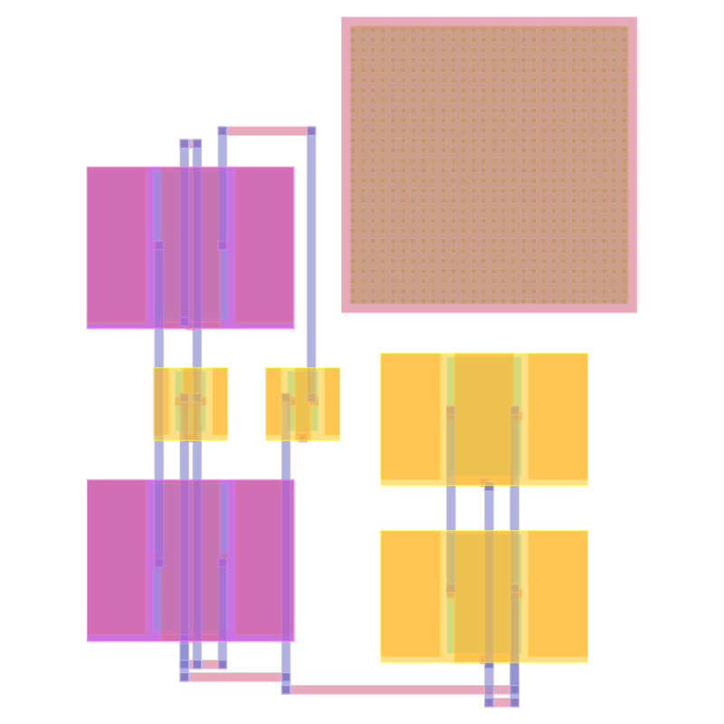

# PNR

Analog place-and-route engine. SPICE netlist in, DRC/LVS-clean GDS out.

## Example outputs

### OTA (5T operational transconductance amplifier)
5 cells, 9 nets — LVS MATCH, 0 DRC

<p align="center"></p>

### tt08-analog-adc (13 transistors)
13 cells, 13 nets — LVS MATCH, 0 DRC

<p align="center"></p>

### tt08-analog-ring-osc (ring oscillator driver)
4 cells, 5 nets — LVS MATCH, 0 DRC

<p align="center"></p>

### TT08 (5T OTA variant, 7 cells)
7 cells, 8 nets

<p align="center"></p>

### tt08-analog-vco (VCO inverter, 2 cells)
2 cells, 4 nets — LVS MATCH, 0 DRC

<p align="center"></p>

## Usage

```bash
# Run the benchmark suite
cargo run --release -p pnr-benchmark

# Run with external TinyTapeout fixtures
cargo run --release -p pnr-benchmark -- tinytapeout

# Convert GDS to SVG
cargo run --release -p pnr-benchmark --bin gds2svg -- output.gds pdks/sky130.json out.svg

# Interactive GPU viewer
cargo run --release -p pnr-visualizer -- output.gds pdks/sky130.json
```

## Architecture

```
frontend/          SPICE parsing, orchestrator (parse → place → route → signoff)
backend/
  engine/          Generic SA/analytical optimization framework
  placement/       Analog placement (symmetry, CC, proximity constraints)
  routing/         Global + detailed routing (PathFinder)
  cells/           Cell generators (MOSFET, resistor, capacitor, BJT, diode)
  constraints/     Constraint types and contract system
verify/            DRC, LVS, PEX (CPU + optional GPU)
tools/visualizer/  GPU-accelerated GDS viewer + SVG export
pdks/              PDK configurations (sky130, generic_finfet)
benchmark/         Benchmark harness with external circuit fixtures
```
