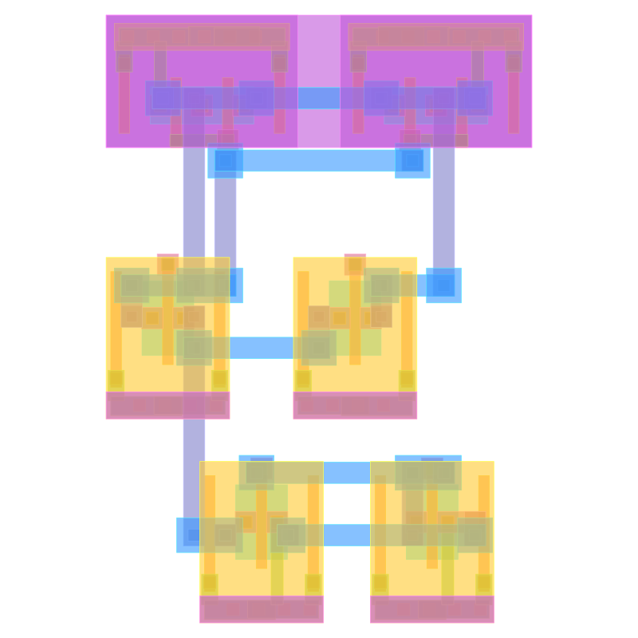
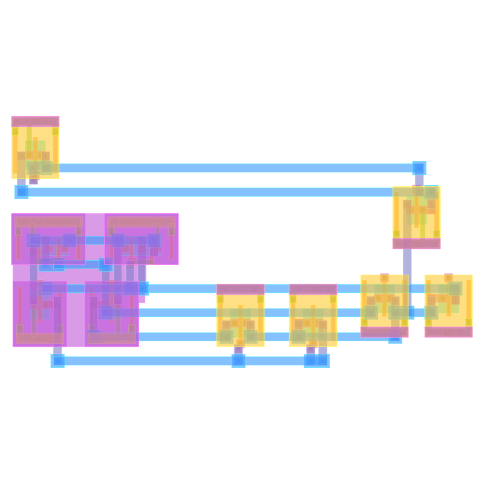
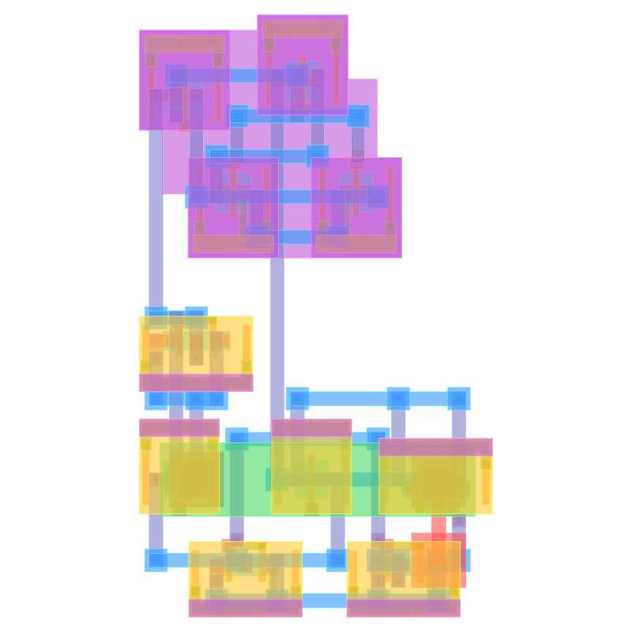
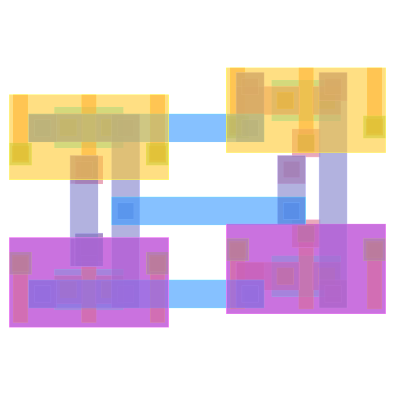
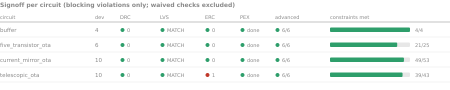
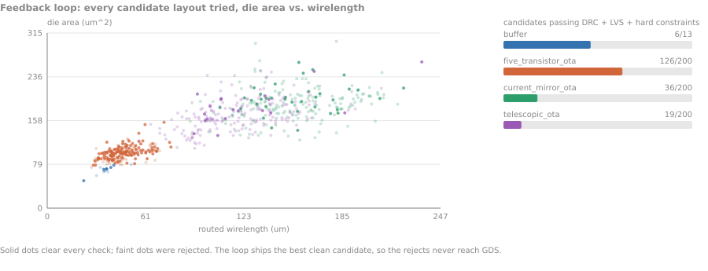
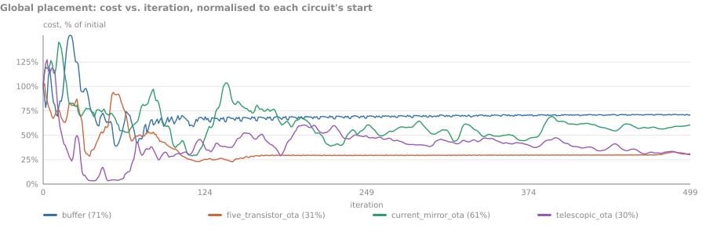

# Philis

Analog place-and-route: a SPICE netlist plus a PDK go in, a signed-off GDS
layout comes out. Philis parses the netlist, recognises structure, generates
device cells, places and routes them under analog constraints (symmetry,
matching, proximity, thermal), and runs physical verification (DRC / LVS / PEX /
ERC) before emitting GDS.

Verification is provided by [`gdsverify`](https://github.com/UW-ASIC/GPurify),
consumed as an external crate.

## Example layouts

Generated end-to-end from SPICE on the SKY130 PDK.
Circuits sourced from [ALIGN-pdk-sky130](https://github.com/ALIGN-analoglayout/ALIGN-pdk-sky130)
and [ALIGN-public](https://github.com/ALIGN-analoglayout/ALIGN-public), adapted
to sky130 device names:

| | |
|:---:|:---:|
| <br>**five_transistor_ota**, 6 devices, 7 nets | <br>**current_mirror_ota**, 10 devices, 10 nets |
| <br>**telescopic_ota**, 10 devices, 11 nets | <br>**buffer**, 4 devices, 5 nets |

| Circuit | Devices | Die (nm) | WL (nm) | Vias | DRC | LVS | Time |
|---|---:|---:|---:|---:|---|---|---:|
| five_transistor_ota | 6 | 7480 x 10325 | 29100 | 38 | 0 | MATCH | 52s |
| current_mirror_ota | 10 | 18300 x 9885 | 108860 | 60 | 0 | MATCH | 274s |
| telescopic_ota | 10 | 9170 x 14600 | 92580 | 68 | 0 | MATCH | 278s |
| buffer | 4 | 7190 x 6860 | 23000 | 26 | 0 | MATCH | 3s |

Seed 42, a budget of 200 feedback iterations, release build, single-threaded on
a Ryzen.

## Results

Every chart below is drawn from the artifacts of those four runs. To redraw
them after a run of your own:

```sh
python3 tools/readme_charts.py out_*/
```

### Signoff



Three of the four circuits come out with a clean tapeout policy: no blocking
DRC, an LVS match against the source netlist, PEX complete, and all six advanced
checks (antenna, density, IR-drop, electromigration, reliability, ESD/latchup)
clean. Each run also waives one density DRC.

telescopic_ota is the exception and the policy blocks it. The layout is DRC and
LVS clean, but one ERC violation survives: two conductors are connected only
through the well, which is a real high-resistance path rather than a false
positive. Two further ERC multiple-driver reports on the same circuit are
waived, as they are on the other three.

The right-hand bar counts constraint contracts. Placement contracts (symmetry,
matching, proximity, isolation) are met everywhere. The gaps are routing
crosstalk contracts that the detailed router either violated or never consumed.

### The feedback loop



Philis does not place, route, and hope. It runs the whole flow repeatedly and
throws away anything that fails signoff, which is most of what it produces. On
telescopic_ota only 19 of 200 candidates cleared DRC, LVS, and the hard
constraints; on current_mirror_ota, 36 of 200. five_transistor_ota is the easy
case at 126 of 200. buffer stopped after 13 iterations because the search
converged, the rest ran until the budget was gone.

The scatter is the trade the loop is actually making. Die area and routed
wirelength move together, so the cheap way to hit a wirelength target is to
spread out, and the loop has to be told not to. The shipped layout is the best
candidate that passed everything, which for five_transistor_ota was iteration
103 and for telescopic_ota iteration 174.

### Placement



Global placement cost over 500 iterations, each curve scaled to its own starting
cost. The two OTAs with a dense constraint set end near 30% of where they
started; buffer only gets to 71%, which is what a four-device circuit with
almost no freedom looks like. None of the curves descend monotonically, and all
four overshoot their own starting cost at some point. The phase also hands on
its last iterate rather than the best one it saw: telescopic_ota passes through
3% of its starting cost partway and still finishes at 30%. Keeping the incumbent
is the obvious thing left on the table here.

Detailed placement is not plotted. It anneals a different objective and its cost
column is not on the same scale as the global one, so putting both on one axis
would imply a descent that is not there.

## Quick start

```sh
nix develop                       # toolchain + PDK (installs sky130A into .pdk/)
cargo build --release
```

Run the full PNR flow:

```sh
cargo run --release -- run <netlist.spice> <pdk.json> -o out
```

Example:

```sh
cargo run --release -- run temporary/circuits/five_transistor_ota.sp pdks/sky130.json -o out
```

Use a config file for repeatable runs:

```sh
cargo run --release -- run circuit.sp pdks/sky130.json -c run.json
```

```json
{
  "seed": 42,
  "utilization": 0.35,
  "die": [50000, 40000],
  "pad_nets": ["vdd", "vss"],
  "max_iters": 200,
  "placement": {
    "cell_margin": 1500,
    "detailed_alpha": 0.95
  },
  "routing": {
    "pitch": 460,
    "wire_width": 300
  }
}
```

CLI flags override any value in the config file. See `philis run --help` for the
full list.

Convert a layout to SVG:

```sh
cargo run --release -- gds2svg <file.gds> -p pdks/sky130.json -o out.svg
```

## Flow

```
SPICE + PDK
   │  parse            frontend/core        text → dense hypergraph
   │  annotate         frontend/annotator   flat netlist → hierarchy
   │  constrain        backend/constraints  symmetry / matching / proximity …
   │  generate cells   backend/cells        devices → drawn geometry
   │  place            backend/placement    analytical descent + SA
   │  route            backend/routing      global + detailed
   │  signoff          gdsverify            DRC / LVS / PEX / ERC
   ▼
  GDS
```

Stage order is fixed by the backend facade (`pnr_backend::Backend`); callers
supply data through `FlowInput` and cannot reorder stages. Algorithm extensions
plug into the data-oriented engine slots in `pnr_backend::strategy`.

Each run writes its own evidence into the output directory: `report.txt` and
`route_report.txt` for the per-stage numbers, `global_trace.csv` and
`detailed_trace.csv` for the placement traces, `feedback.jsonl` for one record
per outer iteration, and `signoff.json` plus `signoff.txt` for the verification
result. The charts above read those files directly, so a chart cannot drift away
from the run that produced it.

## Workspace

```
philis                 root CLI (src/main.rs)

frontend/
  core                 orchestrator, SPICE parse, PDK load (pnr-core)
  annotator            structural hierarchy recognition
  substrate3           user-facing custom-cell API

backend/               constraints → cells → engine → placement → routing → facade
  cells                device generators + netlist hypergraph + PDK cell contract
  constraints          constraint contracts
  engine               data-oriented SA engine (cost / schedule / accept / legality)
  placement            analytical + simulated-annealing placement
  routing              global + detailed routing
  (backend)            facade / template method, GDS writer, PDK loader

tools/
  visualizer           GDS → SVG (pnr-visualizer)
  benchmark            `bench` + `gds2svg` binaries
  readme_charts.py     redraws the charts above from a run directory
```

Backend crates form a strict DAG (`cells`/`constraints` → `engine` →
`placement` → `routing` → `backend`); the direction is enforced by tests in
`backend/src/lib.rs`. Lower crates never depend on the composition root, and the
backend never depends on the frontend.

## Benchmark

```sh
nix develop -c cargo run --release -p pnr-benchmark --bin bench [local|align|magical|tinytapeout|all]
```

`local` runs the four bundled fixtures in `tools/benchmark/fixtures/`. The other
suites clone external circuit repos on demand and clean up afterwards. Each run
prints a per-circuit table (timing, wirelength, unrouted, DRC/LVS, area,
utilisation) and a constraint-satisfaction summary, and writes debug artifacts
to `target/bench_debug/<name>/` plus SVGs to `assets/`.

There is no head-to-head comparison against ALIGN or MAGICAL yet. The circuits
are taken from their repos, but the published results are not in a form these
numbers can be lined up against, so nothing here claims a speedup.

## Dependencies

`gdsverify` is pinned to a reviewed revision in the root `Cargo.toml`
`[workspace.dependencies]`; bump the `rev` there to track new GPurify commits.
The `nix develop` shell provides the Rust toolchain, ngspice, KLayout, the
sky130A PDK, and (on Linux) CUDA / Vulkan for the optional `gpu` feature and the
visualizer.

## PDKs

PDK JSON files live in `pdks/` (`sky130.json`, `generic_finfet.json`). This is
Philis's own schema, with device entries keyed by full model name carrying an
electrical `type` and a generator `cell`. It is not gdsverify's internal PDK
format. `tools/pdks` symlinks to `pdks/` so the benchmark resolves them.
