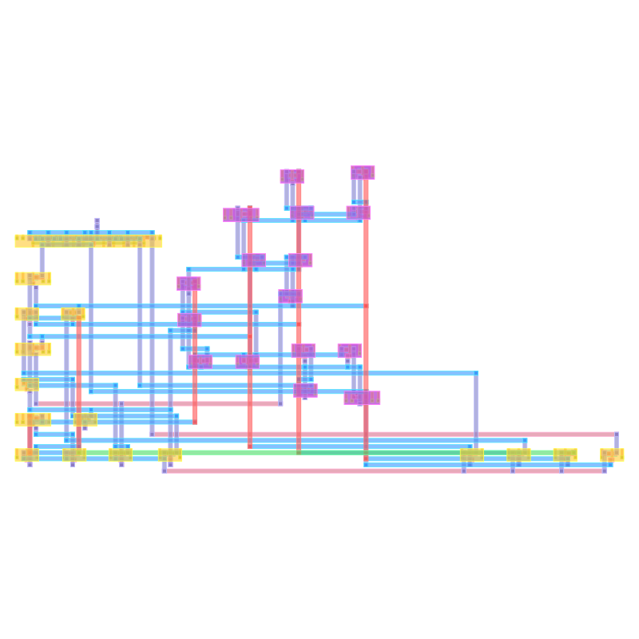
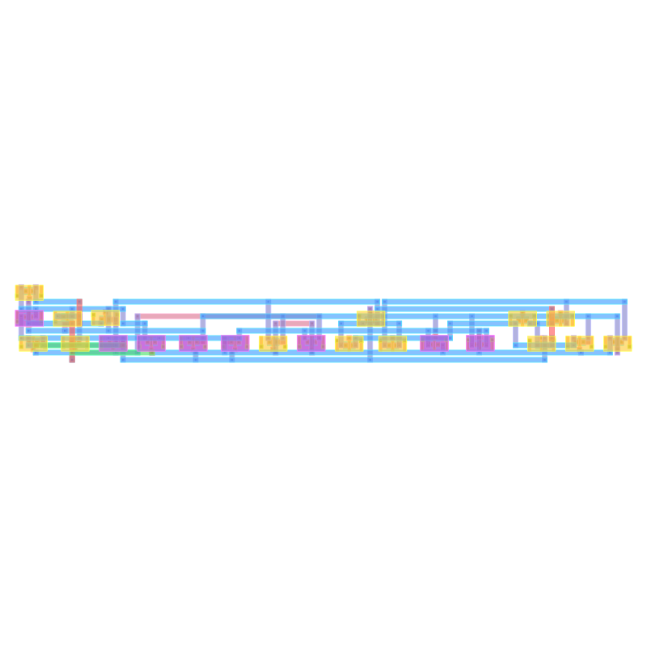
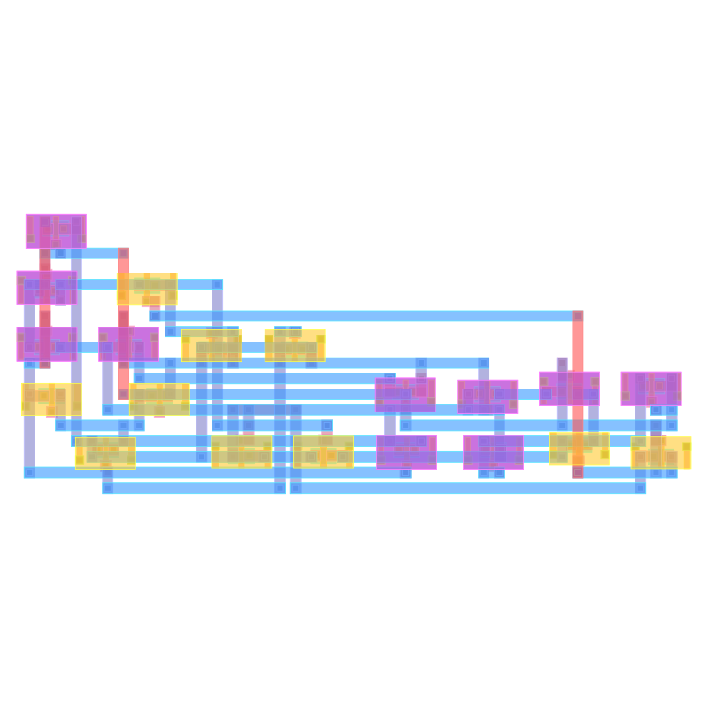
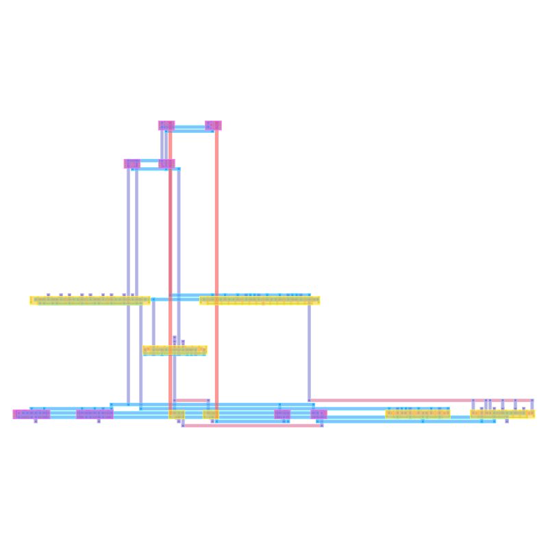

# Philis

Analog place-and-route: a SPICE netlist plus a PDK go in, a signed-off GDS
layout comes out. Philis parses the netlist, recognises structure, generates
device cells, places and routes them under analog constraints (symmetry,
matching, proximity, thermal), and runs physical verification (DRC / LVS / PEX /
ERC) before emitting GDS.

Verification is provided by [`gdsverify`](https://github.com/UW-ASIC/GPurify),
consumed as an external crate.

## Example layouts

Generated end-to-end from SPICE by the benchmark suite (generic FinFET PDK):

| | |
|:---:|:---:|
| <br>**VCO_type2_65** — 30 devices, 28 nets | <br>**comparator1** — 22 devices |
| <br>**cascode_current_mirror_ota** — 20 devices | <br>**high_speed_comparator** — 15 devices |

## Quick start

```sh
nix develop                       # toolchain + PDK (installs sky130A into .pdk/)
cargo build --release
cargo run --release -- <netlist.spice> <pdk.json> [out_dir]
```

Example:

```sh
cargo run --release -- tools/benchmark/fixtures/pair.spice pdks/sky130.json out
```

The `philis` binary reads the netlist and PDK, runs the full flow, writes
`<top>.gds` into `out_dir`, and prints a one-line signoff summary (DRC / LVS /
unrouted / GDS path). It exits non-zero if signoff is not clean.

## Flow

```
SPICE + PDK
   │  parse            frontend/core        text → dense hypergraph
   │  annotate         frontend/annotator   flat netlist → hierarchy
   │  constrain        backend/constraints  symmetry / matching / proximity …
   │  generate cells   backend/cells        devices → drawn geometry
   │  place            backend/placement    analytical descent + SA
   │  route            backend/routing      global + detailed
   │  signoff          gdsverify            DRC / LVS / PEX / ERC
   ▼
  GDS
```

Stage order is fixed by the backend facade (`pnr_backend::Backend`); callers
supply data through `FlowInput` and cannot reorder stages. Algorithm extensions
plug into the data-oriented engine slots in `pnr_backend::strategy`.

## Workspace

```
philis                 root CLI (src/main.rs)

frontend/
  core                 orchestrator, SPICE parse, PDK load (pnr-core)
  annotator            structural hierarchy recognition
  substrate3           user-facing custom-cell API

backend/               constraints → cells → engine → placement → routing → facade
  cells                device generators + netlist hypergraph + PDK cell contract
  constraints          constraint contracts
  engine               data-oriented SA engine (cost / schedule / accept / legality)
  placement            analytical + simulated-annealing placement
  routing              global + detailed routing
  (backend)            facade / template method, GDS writer, PDK loader

tools/
  visualizer           GDS → SVG (pnr-visualizer)
  benchmark            `bench` + `gds2svg` binaries
```

Backend crates form a strict DAG (`cells`/`constraints` → `engine` →
`placement` → `routing` → `backend`); the direction is enforced by tests in
`backend/src/lib.rs`. Lower crates never depend on the composition root, and the
backend never depends on the frontend.

## Benchmark

```sh
nix develop -c cargo run --release -p pnr-benchmark --bin bench [local|align|magical|tinytapeout|all]
```

`local` runs the four bundled fixtures in `tools/benchmark/fixtures/`. The other
suites clone external circuit repos on demand and clean up afterwards. Each run
prints a per-circuit table (timing, wirelength, unrouted, DRC/LVS, area,
utilisation) and a constraint-satisfaction summary, and writes debug artifacts
to `target/bench_debug/<name>/` plus SVGs to `assets/`.

Convert a layout to SVG directly:

```sh
cargo run -p pnr-benchmark --bin gds2svg -- <file.gds> [pdk.json] [out.svg]
```

## Dependencies

`gdsverify` is pinned to a reviewed revision in the root `Cargo.toml`
`[workspace.dependencies]`; bump the `rev` there to track new GPurify commits.
The `nix develop` shell provides the Rust toolchain, ngspice, KLayout, the
sky130A PDK, and (on Linux) CUDA / Vulkan for the optional `gpu` feature and the
visualizer.

## PDKs

PDK JSON files live in `pdks/` (`sky130.json`, `generic_finfet.json`). This is
Philis's own schema — device entries keyed by full model name with an
electrical `type` and a generator `cell` — distinct from gdsverify's internal
PDK format. `tools/pdks` symlinks to `pdks/` so the benchmark resolves them.
