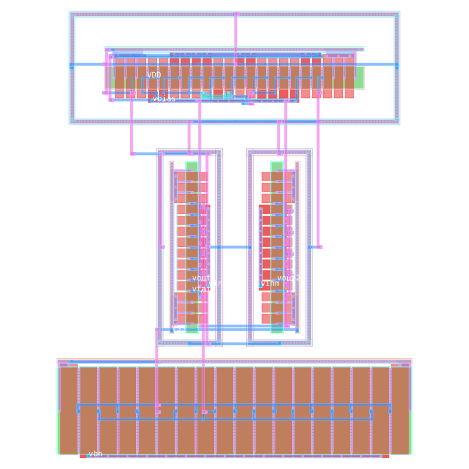
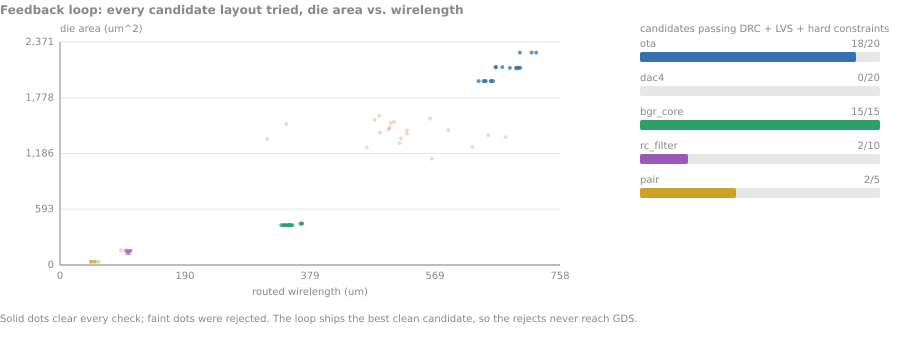
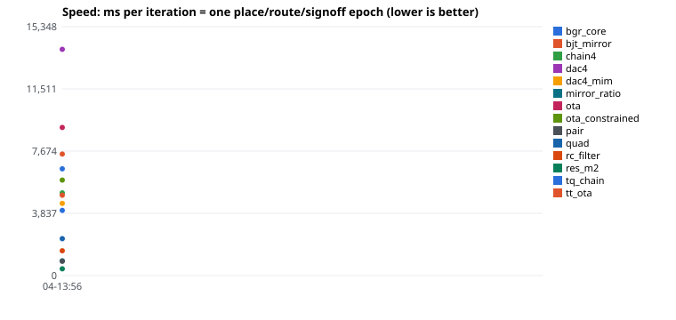
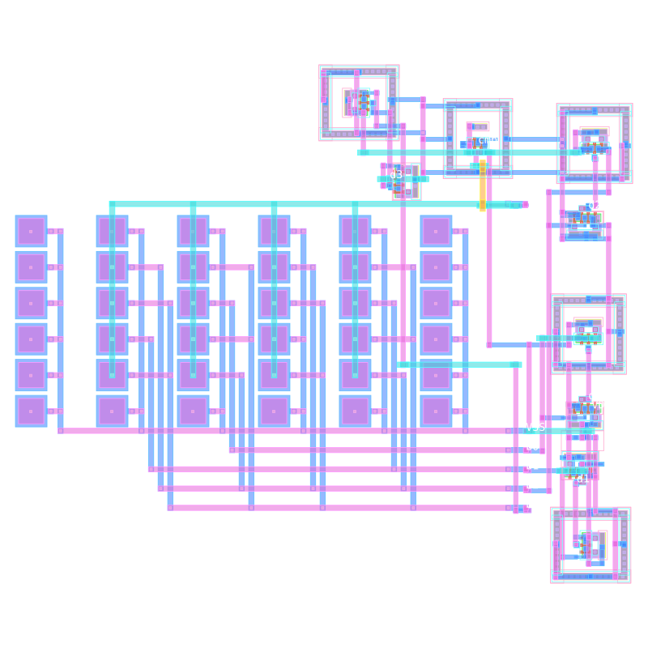
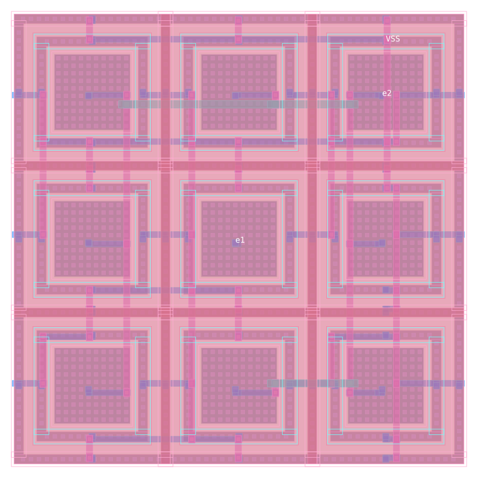
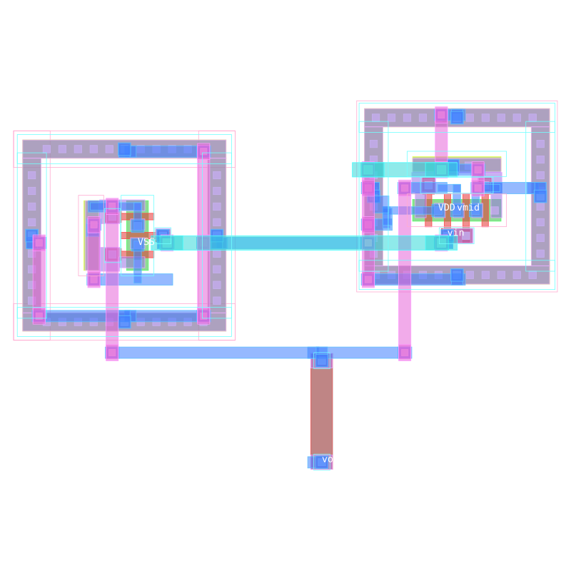
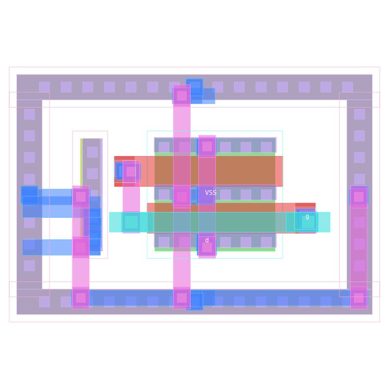
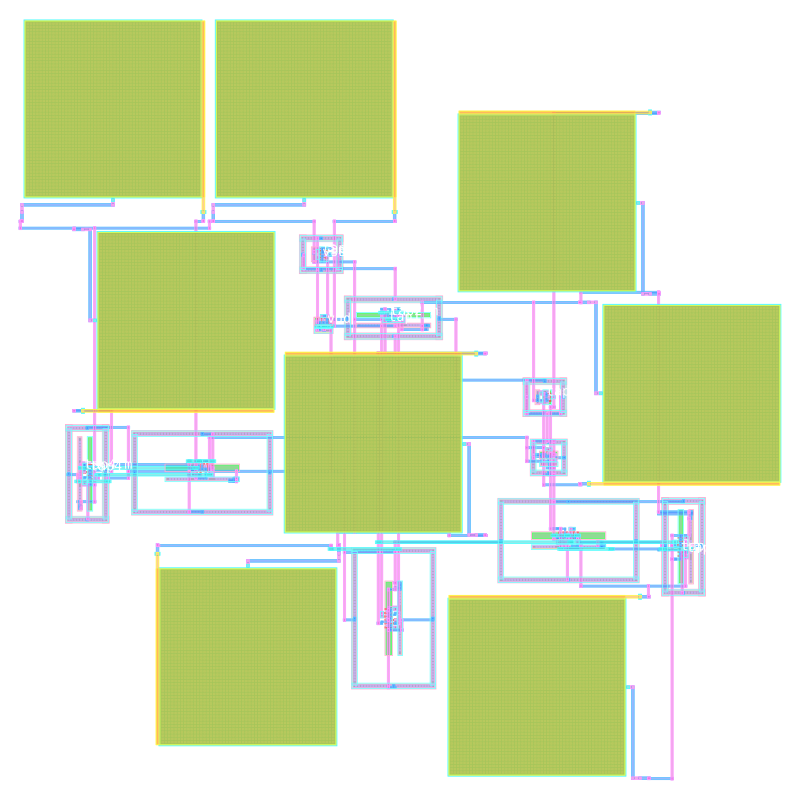

# Philis

**Analog layout from a SPICE netlist.** Philis recognises the circuit's topology, derives the layout constraints an analog designer would apply, then places, routes and signs off a GDS (DRC, LVS, ERC, PEX).

[](https://github.com/UW-ASIC/Philis/actions/workflows/publish.yml)


[](LICENSE)

<p align="center"></p>

## Quick start

```sh
nix develop    # or: Rust stable + CMake + a C++ compiler
cargo build --release -p philis
./target/release/philis run benchmarks/fixtures/rc_filter.spice sky130 -o out/
```

```text
signoff CLEAN — cost 25.657
wrote out/{rc_filter.gds, rc_filter_ref.spice, rc_filter_pex.spice, signoff.txt, signoff.json, report.txt}
```

- Exit code 0 = signoff clean, 1 = not clean, 2 = error.
- `report.txt` lists every constraint as met, violated or unknown.
- Built-in PDKs: sky130, gf180mcu, ihp_sg13g2 and generic_finfet. Any other process is one JSON sidecar.
- Optional inputs: `--constraints` (ALIGN-style JSON), `--interface` (die and pins), `--op-lib`/`--perf` (ngspice operating point and post-layout specs). Full flag list: [`frontend/cli/src/main.rs`](frontend/cli/src/main.rs).

## Analog constraints

The annotator reads the netlist and emits constraints. Each one is enforced at one of three tiers: **hard** (must hold), **budget** (shares a bounded allowance) or **cost** (minimised).

How constraints are found:
- **Structure:** 91 recognised topologies (differential pairs, current mirrors, cascodes, latches, OTAs, …), shared-bias groups, identical sub-circuit instances, and symmetry spread through mirrored nets.
- **Net classes:** from names and connectivity.
- **Electrical evidence (optional):** operating point and spec sensitivities.
- **User sidecar:** ALIGN-style JSON that adds or overrides constraints.

Devices that match no topology still get every routing and reliability rule. They get no placement constraint unless symmetry propagation or the sidecar reaches them. Catalog-free extraction is planned ([#75](https://github.com/UW-ASIC/Philis/issues/75)).

**Offset and mismatch** (Pelgrom; Hastings ch. 13)
- Matched sets: one mismatch ledger per pair (random σ, gradient, thermal and LOD terms) against one offset allowance, with a precision class (minimal / moderate / precise)
- Common-centroid 1-D and 2-D arrays and interdigitation, with first and second unit moments equalised
- Matched channels parallel, with equal mean source→drain current direction
- Equal well-proximity (WPE) and STI/LOD stress distances; edge dummies
- Capacitor arrays (binary-weighted and split DACs) placed under an oxide-gradient model, with equal lead capacitance per unit

**Symmetry and structure** (Balasa–Graeb)
- Mirror symmetry about shared axes; each symmetry group forms one connected island
- Signal-flow and current-flow ordering; proximity of related devices; utilisation floor

**Noise and coupling** (Charbon)
- Crosstalk: pairwise exclusion, and total coupling per victim summed over every aggressor
- Shielding of sensitive nets by a reference net
- Substrate: noisy-to-sensitive spacing and deep-trench isolation banding
- Guard rings by role (injector, aggressor, victim) and construction (tap ring, electron-collecting ring, hole-collecting ring, isolated tub)
- No metal over matched gates or precision resistor bodies

**Parasitics and performance**
- Differential nets routed matched and mirrored; common-node resistance balanced across branches
- Per-net parasitic budgets, and circuit specs as a shared parasitic budget over the routed nets
- Performance-driven placement: estimated ground capacitance on spec-sensitive nets
- Optional post-layout simulation against `--perf` specs

**Reliability**
- Electromigration (DC, per layer and via; wires and via arrays sized to current) — hard
- IR drop along current-carrying nets
- Antenna ratio, fixed with jumpers or inserted diodes — hard
- |V<sub>GS</sub>| and |V<sub>DS</sub>| against oxide and drain ratings; forward-biased junctions; ESD width floor on pad nets; latch-up deck rules

**Thermal**
- Matched sets kept isothermal and away from power dissipators

Net classes decide which rules a net gets: signal, clock, supply, ground, substrate, sensitive, bias, reference, static and switching digital, noisy.

## How it works

```text
SPICE → annotator → device generators → placement (analytic → anneal / sequence pair)
      → routing (negotiated global → track-lattice detailed) → signoff (DRC, LVS, ERC, PEX)
        ↑__________ each epoch's violations and spec misses steer the next __________|
```

The search ships only the best clean candidate. Design notes and the roadmap are in [`docs/plans/`](docs/plans/00-MASTER-PLAN.md).

## Results

Re-run on every push to `main`.

<!-- progress:start -->
_Last snapshot: 2026-10-04 14:28, branch `m2 + progress-charts` at `3032483` (`bench local`, sky130, seed 1). Updated automatically by `benchmarks/progress.py`._

### Feedback loop



### Speed



| circuit | wall ms | iterations | ns/iter | DRC | LVS | ERC |
|---|---|---|---|---|---|---|
| bgr_core | 56,132 | 15 | 3,742,133,333 | 0 | MATCH | 0 |
| dac4 | 113,905 | 20 | 5,695,250,000 | 7 | PARTIAL(16) | 1 |
| ota | 344,260 | 20 | 17,213,000,000 | 0 | MATCH | 0 |
| pair | 14,169 | 5 | 2,833,800,000 | 0 | MATCH | 0 |
| rc_filter | 14,081 | 10 | 1,408,100,000 | 0 | MATCH | 0 |
| tq_chain | 155,605 | 20 | 7,780,250,000 | 18 | MATCH | 5 |

### Sample layouts

**ota**


**dac4**



**bgr_core**



**rc_filter**



**pair**



**tq_chain**


<!-- progress:end -->

## Status

Pre-1.0. Most sample circuits sign off clean; dac4 and tq_chain do not yet ([#70](https://github.com/UW-ASIC/Philis/issues/70)). The [`publish`](.github/workflows/publish.yml) gate requires DRC 0, ERC 0 and LVS MATCH on every benchmark circuit. Roadmap and bugs: [issues](https://github.com/UW-ASIC/Philis/issues).

## Contributing

```sh
nix develop && cargo test --workspace
cargo run --release -p benchmark --bin bench local   # sign off every benchmark circuit
```

## License

[MIT](LICENSE)
