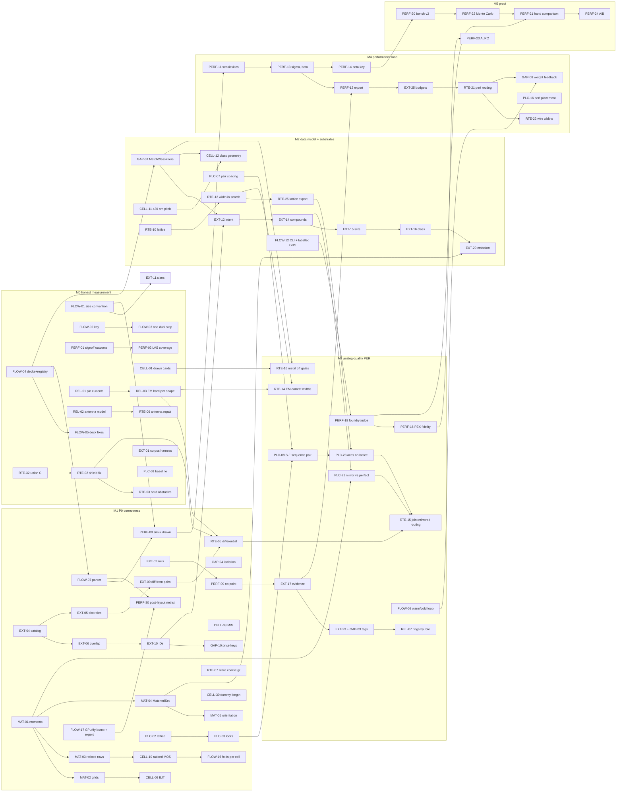

# 00 — Master audit and implementation roadmap (read this first)

## Status (after M0)

M0 ("Honest measurement", §5) ran as `eba9954..e2577a4` on branch `m0` (92 commits); the plan edits in this section
and in the item files are the commit after `e2577a4`. The measured close-out is `m0-report.md` (verify pass 4, on
`44b37f1`, the review-panel fixes). **12 of the 13 M0 exit criteria are met; criterion 2 (`signoff_fixtures` green
including dac4 at `feedback_iters = 1`) is not.** The release suite reads 439 passed, 2 failed, 7 ignored: dac4
`erc/ar.met2.1:gate` (criterion 2) and `hier_elaborate` (8 unpaired devices, 17 unpaired nets), which FLOW-14 made
assert and no M0 item owned.

**Merged through item review (24).** Each item file carries a `Status: done in M0 (<commit>)` line under its heading,
with the deviations that later items must know.

| Item | Merge commit | Item | Merge commit | Item | Merge commit |
|---|---|---|---|---|---|
| FLOW-14 | `89a1740` | CELL-02 | `85e05bb` | PERF-02 | `6b28fca` |
| GAP-20 | `6da8068` | CELL-04 | `9dba018` | PERF-03 (steps 1–2) | `2f37409` |
| FLOW-04 | `5ebffd8` | EXT-01 | `574cd5e` | PERF-04 | `0e53eb9` |
| FLOW-05 | `bb556b4` | PLC-01 | `339d1d6` | PERF-06 | `0dabdb5` |
| FLOW-01 | `f90c5e7` | RTE-32 | `e5abfc8` | PERF-07 | `becffeb` |
| FLOW-02 | `65f5f8c` | RTE-02 | `de602df` | REL-01 | `e7db737` |
| FLOW-03 | `de04d31` | RTE-09 | `e4915ea` | REL-02 | `dac139f` |
| CELL-01 | `409e74b` | PERF-01 | `5478230` | REL-03 | `76e7232` |

The review panel's 26 findings were fixed in `44b37f1` except the two owner decisions below and the per-net half of
finding 20 (m0-report §7).

**Not merged, and where each goes:**

- **RTE-06** (antenna repair on drawn geometry): rejected; its own acceptance was red with the same dac4 row. Commits
  kept on branch `m0-rte06-rejected`. Carried into M1 (step 0) together with M0 exit criterion 2. Two facts change
  the order: `routing_stack` gives dr only met1/met2 on sky130, so a cap plate on met2 already over the limit cannot be
  repaired inside dr; and the 2026-10-01 handoff note on `main` records dac4's ERC fixed by GPurify `bde681c` on branch
  `fix-export` (not measured on m0). So FLOW-17 (GPurify bump) lands first and dac4 is re-measured before RTE-06 is
  re-reviewed.
- **RTE-03** (foreign metal hard; shorts, opens, congestion as V): not merged through review, but its code is on m0
  as `ba49ae2` (ported outside the review; originals on `m0-rte03-original`). Acceptance 3 is not met: 7 of dac4's 90
  dr reports carry `unresolved congestion` with `drawn short nets` V (none a winner; 0 of 450 on the other 9
  circuits). **Owner decision open:** keep `ba49ae2` with acceptance 3 recorded as not met, or revert it. Until it is
  taken, RTE-08 (M1) carries acceptance 3; criterion 11 holds only while `ba49ae2` stays.
- **PERF-03 steps 3–4** (library port list, fixture headers): wait for FLOW-07's `Netlist.ports`; already M1 step 1.

**Follow-ups found in M0, now owned (all M1):**

- `hier_elaborate` red → FLOW-13 step 0.
- OTA `CommonCentroid` rows 3/3 → 0/3 since FLOW-01 drew the simulated size (`cellgen::folds` ignores
  CommonCentroid) → FLOW-16 step 4; FLOW-16 moves from M2 to M1.
- REL T2 is checked per fixture, not per net (signoff ERC rows carry no net) → REL-02, after the GPurify request in
  §6.4 Q7.
- RTE-09's acceptance grep `'kind()'` also matches `repair_kind()`; the word-bounded form is empty on m0 and replaces
  it in the M1 RTE exit criterion.

**Line numbers.** Plan items quote file:line as of `dad330c`. M0 changed 96 code, CI and PDK files, most in
`backend/dr/src/lib.rs`, `frontend/library/src/lib.rs`, `backend/verify/src/{lib,pdk}.rs` and `kernel/analog/src/
routing/em.rs`, so later citations into those files are off by tens to hundreds of lines. The M1 items whose text M0
changed carry m0 anchors (EXT-04/06/10/11, MAT-06, CELL-06/08, PLC-02/03/04/06, RTE-05/07/08, PERF-03/08/09, FLOW-07,
FLOW-16, GAP-04, GAP-10); every other citation is resolved by the symbol it names.

**Field report 01** (`field-report-01-tinytapeout.md`, TinyTapeout flows on ~10 sky130 blocks). The reporter ran the
EDA-Packaged build, which is Philis `e8bc59e` with GPurify `e3c8eb2` (field report 02's root cause on `main`,
`c3a1303`): its "extracting feedback" line exists only at `e8bc59e` `backend/engine/src/block.rs:322`, and its LVS
"device class N has a in layout vs b in reference" only in GPurify `e3c8eb2` `crates/lvs/src/gpu_compare.rs:397`.
Every item was therefore re-run on m0 (the m0 CLI and bench on the reporter's netlists under
`ResearchBoutros/analog/<block>/`, sky130, a throwaway copy that prints hard rows; nothing of it is committed):

| FR | Report | On m0 | Owner (milestone) |
|---|---|---|---|
| FR-1 | Hang with several `cap_mim_m3_1`; one cap → LVS device-class mismatch | No hang (tq_chain, 8 caps: 3 min 20 s, 37 MB). Every cap circuit shorts: no sky130 capacitor recipe, so the MIM is drawn as met1/met2 MOM plates on the only two routing layers; 1 cap → `drawn short net … to cell metal` in all 56 dr reports and signoff label short `vss`/`tap1`; 8 caps → label short plus 5 × `m1.2`, 1 × `via.2`; wta → label short `vss`/`mrail` | CELL-08 (M1, P0) |
| FR-2 | 45–60 min per iteration, no early stop | Old engine. m0 stops on convergence: strongarm 2.5 min, ptat_bias 6.8 min, pwm_driver 6.4 min, wta 5.2 min (default `Config`) | FLOW-09 (M2), FLOW-08 (M3) |
| FR-3 | False LVS "device class N" on ptat_bias, pwm_driver | Message is GPurify `e3c8eb2`'s. ptat_bias CLEAN. LVS parameter mismatches remain: strongarm 4 × `lvs.parameter_mismatch`, pwm_driver 16 (bench) | FLOW-17 (new, M1, P0) |
| FR-4 | Generator DRC: poly min-extension on long-L PFETs and W = 0.42; residual `li.3` | Generators clean: rescale and ptat_bias sign off CLEAN; long-L and 0.42 µm PMOS cells DRC 0. No sweep draws those sizes. Routing-layer DRC on pwm_driver: `m1.2.notch`, `m2.2.notch`, `m1.7`, `m2.7` (hole area) | CELL-30 (new, M1) guard tests; RTE-26 (M2) routing cases |
| FR-5 | Long-L cell ≈ 3·L wide (0.42/64.8 µm → ~196 µm) | Reproduced: with dummies the cell is 196 340 nm (65 740 without); dummy gates are drawn at the active L | CELL-30 (new, M1, P0) |
| FR-6 | Short vb_tail–nl in a 7-device PTAT core | That netlist is not in the report; ptat_bias CLEAN. FET-only pwm_driver shorts (`label short` `vss`/`ba_m`, reproducible), with `drawn short nets` in 4 of 25 non-empty dr reports | RTE-08 with RTE-03 (M1) |
| FR-7 | `extracted_pex.spice` not simulatable | m0 writes no post-layout netlist from `run`/CLI; `verify::extract_spice` gives `.subckt TOP` with no ports, 3-terminal MOS cards, database-unit lengths, valueless resistors | PERF-30 (new, M1, P0); export via FLOW-17 |
| FR-8 | Only sky130/generic_finfet shipped | m0 compiles in all four PDKs (FLOW-04); packaging is outside the repo | FLOW-04 (done), FLOW-17 `--version`, FLOW-12 |

---

Scope: Philis, the Rust analog place-and-route flow at this repository. Goal stated by the owner: "the best Automated
Analog P&R tool that is constraint aware, and is able to extract constraints from the circuit", producing layouts
that beat hand layout.

This file merges 7 code audits (`audit-01` … `audit-07`), 19 reference studies (`ref-*.md`), 8 area plans
(`plan-01` … `plan-08`) and the cross-plan gap critic (`98-gap-critic.md`). It adds no new analysis of the code; every
code fact below is quoted from those documents, and the ones that carry the verdict were re-read in the working tree
of 2026-09-28 (HEAD `dad330c` plus uncommitted changes) for this file: `backend/annotator/src/pattern.rs:199-210`,
`backend/annotator/src/emit.rs:137-141`, `kernel/analog/src/routing/shield.rs:55-62`,
`frontend/library/src/elaborate.rs:208-220`, `frontend/library/src/oppoint.rs:268-287`,
`backend/verify/src/checker.rs:176-200`, `kernel/cells/src/inductor.rs:40-66`, `kernel/cells/src/bjt.rs:207-232`,
`backend/dp/src/lib.rs:553-562` and `:362-365`, `backend/gp/src/lib.rs:323-326`,
`kernel/analog/src/routing/em.rs:107-131`, `kernel/cells/src/mosfet.rs:780-790`,
`kernel/cells/src/cap_array.rs:415-418, 511-515`. No cargo command was run for this file. Runtime facts come from the
one designated ground-truth run in audit-06 §G (2026-09-28).

Conventions:
- Item IDs are the plans' own: `EXT-` (plan-01), `MAT-` (plan-02), `CELL-` (plan-03), `PLC-` (plan-04), `RTE-`
  (plan-05), `REL-` (plan-06), `PERF-` (plan-07), `FLOW-` (plan-08), `GAP-` (98-gap-critic). Finding IDs: `AA-`
  (audit-01), `AR-` (audit-02), `AC-` (audit-03), `AP-` (audit-04), `AT-` (audit-05), `AV-` (audit-06), `AF-`
  (audit-07). Reference-entry IDs (`H13-42`, `LAMP-09`, `MM-30`, …) point into the `ref-*.md` studies, which carry the
  reftext line ranges and PDF pages.
- Where a plan's text disagrees with §6 of this file, §6 wins. Most of §6 is the critic's resolution; the rest is
  marked **[master decision]**.
- Numbers marked **[derived]** are arithmetic on cited values done in the cited plan or audit, not source statements.

---

## 1. Verdict

**Philis today is a complete, well-structured pipeline whose results cannot yet be trusted, and which has not been
compared to a single hand layout.** It is not yet the best constraint-aware analog P&R tool, and nothing in the
repository measures whether it beats hand layout.

What is real:
- The whole chain runs: SPICE → annotator → device generators → gp → dp → gr → dr → GPurify signoff, in an epoch loop
  ranked lexicographically by `(|V|, spec miss, Θ, C, footprint)` (`frontend/library/src/lib.rs:916-958`). The ground
  truth run built in 2.4 s, passed 331 of 332 run tests, and routed all 10 bench circuits with DRC 0 and "LVS MATCH"
  in 539.5 s (audit-06 §G.2–G.3, `audit-06-verify-signoff-bench.md:204, 231-233`).
- The architecture is sound and every plan keeps it: the `Rule`/`RuleBatch` seam with hard / budget / cost arms
  (`kernel/analog/src/rule.rs:9-208`), deck-driven generators DRC-checked against the real decks, D4 geometry, the
  thermal unit conversion, the EM derating/Blech math and the Stack R/C units (audit-02 conclusions), per-stage
  antenna with jumper repair (H05 findings), and a point-symmetric cap-array generator (audit-03).

What is not real yet, in order of damage:
1. **Several verdicts are vacuous.** LVS skips every device the deck cannot recognise and cellgen drops every
   capacitor before LVS, so `bjt_mirror` (2/2 devices) and `bgr_core` (9/9) print MATCH after comparing nothing
   (AV-01). ERC drops `floating_gate` on every labelled net (`backend/verify/src/checker.rs:176-200`, AV-04). The
   simulated circuit is not the drawn one: the FET card is `W={w} L={l} nf={nf}` with `m` dropped
   (`frontend/library/src/oppoint.rs:277-285`), so XM5 of the OTA is simulated at a quarter of its drawn width
   (AF-01). Three generators can be silently wrong because LVS does not check values: capacitors are met1/met2 MOM at
   ~0.105 fF/µm² extracted while sizing assumes the MIM's 2.0 fF/µm² (AC-01, AV-32); resistors and diodes ignore
   `m`/`nf` (AC-02); the inductor's turns are all anchored at (0,0) and short together
   (`kernel/cells/src/inductor.rs:46-48`, AC-03).
2. **Constraint extraction covers two-device FET leaves only.** 103 FET-only patterns
   (`backend/annotator/src/pattern.rs:94`) are kept greedily and disjointly (`pattern.rs:201-210`), so a device
   belongs to one structure; one symmetry axis per block (`emit.rs:139`); passives, BJTs and diodes are never
   recognised; net roles are by name only; no precision class, no ratio inference, no operating point (AA-01…AA-12).
   The one contradictory pair of rules it emits (Proximity ≤ 5 µm and Isolation ≥ 10 µm on a clocked tail, AA-13) is
   owned by no plan until GAP-04.
3. **The matching layer measures less than it appears to.** After cell merge, `MatchingPair` reads D = 0 and
   `ThermalGradient` ΔT = 0; `CentroidGroup` pools a whole stage so opposite offsets cancel; the same η·σ_rand is
   granted in full to four or five rules; no rule checks orientation across cells (AR-01, AR-02, AR-04, AR-36).
4. **Placement and routing are generic engines with analog repairs.** dp is flat-coordinate annealing plus projection
   plus a greedy push legalizer, with one 1270 nm clearance for every pair (AP-01, AP-02). On sky130 the router uses
   met1 and met2 only (`frontend/library/src/elaborate.rs:213-219`, AT-01), treats cell metal as a soft obstacle
   (AT-05), and makes differential pairs "match" by adding a dangling stub (AT-20). The hard EM rule passes when any
   one segment is wide enough (`kernel/analog/src/routing/em.rs:109-130`), while dr's real check sits in Θ (AR-05).
5. **There is no performance loop by default and no proof.** Post-layout scoring is opt-in and never set by the bench
   or CLI (PERF §1.2 P1); sensitivities are ground-C only at one corner; there is no σ, β, yield or Monte Carlo
   (P13). The benchmark has 10 circuits of at most 14 devices, three of them identical, one seed, and no comparison to
   hand layout: the TinyTapeout hand GDS paths are discovered and marked `dead_code` (AV-03, AV-12).

What the plan does: 201 live work items (EXT 27, MAT 19, CELL 24, PLC 25, RTE 30, REL 13, PERF 27, FLOW 16, GAP 20;
counts exclude items each plan cut or deferred) in seven milestones. The order is fixed by one principle: **make every
reported number honest, then correct, then capable, then performance-driven, then proven.** M0–M1 are bug fixes;
nothing new is built on a measurement that lies. The claim "beats hand layout" becomes testable at M5 through a
same-judge comparison on TinyTapeout hand layouts (PERF-21), and not before.

---

## 2. Scorecard

Maturity scale: **0** absent; **1** placeholder; **2** runs, but key physics wrong or unmeasured; **3** correct for the
common cases and measured; **4** better than typical hand practice on the fixtures; **5** proven better than hand
layout under an independent judge.

| Subsystem | Maturity | Justification | Top gaps | Blockers | Audit / plan |
|---|---|---|---|---|---|
| Constraint extraction (`backend/annotator`) | 2 | 103 patterns and determinism for a fixed input order; but FET-only, greedy disjoint (`pattern.rs:201-210`), per-block axes (`emit.rs:139`), inverter shadows cross-coupled in latches (AA-03), names-only rails, 5 of 103 patterns tested | overlapping recognition, circuit-level symmetry (compounds), matched sets with ratio and class, passive/BJT recognition, op-point evidence, contradiction check | FLOW-01 size convention, FLOW-07 ports and values, PERF sensitivities for EXT-21/25 | audit-01; plan-01; GAP-03/04/09 |
| Constraint models (`kernel/analog`, `kernel/core`) | 2 | Core geometry, D4, units, thermal conversion, EM math correct; but matched rules read cell centres (D = 0 after merge), pooled CC, double-spent allowance, shield `min` bug (`shield.rs:59`), coupling counts the victim's own shield, cost tier sums incompatible units | one ledger per matched set (MAT-04), orientation rule (MAT-05), per-shape EM hard (REL-03), dimensionless objective (PLC-18) | none for the P0 fixes | audit-02; plan-02, plan-06 |
| Device generators (`kernel/cells`) | 3 | Every generator DRC-checked on real decks; full contact columns, bulk-tied dummies, split-gate ABBA, 2-row quad, exact CDAC patterns; but wrong capacitor device, R/D ignore `m`, shorted inductor, MOS pitch 730 vs 430 nm on sky130 [derived], ratioed mirrors never merge, BJT arrays off-centroid except 1:8, rings are majority taps named minority | CELL-01 macros record what they drew; value closure (CELL-06/07/08/09); legal ratioed rows (MAT-03/CELL-10); 430 nm pitch (CELL-11); class-scaled environment (CELL-12) | GAP-01 class home; PERF-18 BJT recogniser | audit-03; plan-03; GAP-05 |
| Placement (`backend/gp`, `backend/dp`) | 2 | Legal placements on all fixtures; but no symmetric-feasible representation, one layer-agnostic 1270 nm clearance, off-lattice origins, matched halves can rotate/reshape independently (`backend/dp/src/lib.rs:555-560, 584-620`), two dual steps per epoch (`backend/gp/src/lib.rs:325`, `backend/dp/src/lib.rs:364`), 13,200·n full re-evaluations per dp call, gp untested | per-pair spacing (PLC-07), hierarchical S-F sequence pair (PLC-08/09), locks (PLC-03), warm start (PLC-10), routing halos and perf term (PLC-15/16) | RTE-25 lattice for PLC-28; EXT-14 compounds for PLC-20/21 | audit-04; plan-04 |
| Routing (`backend/gr`, `backend/dr`) | 2 | Completes DRC-clean on fixtures; negotiated rip-up; mirror guide; post-search width/vias/shields; but 2 metals on sky130, one 460 nm pitch, width never reserved in search, soft foreign metal, gr report discarded and grid anchored at (0,0), non-exact symmetry, no star/Kelvin, Dijkstra without A* | per-layer lattice (RTE-10/11), width in search (RTE-12), hard obstacles (RTE-03), joint mirrored routing (RTE-15), metal-over-gate (RTE-16), split nets (RTE-17), performance pricing (RTE-21/22) | REL-01/03 current data; PLC-28 axis contract | audit-05; plan-05 |
| Reliability and substrate | 2 | Per-stage antenna with jumpers, Arrhenius/Blech math, min-width rings sized to R; but EM tiers inverted, every pin gets the whole terminal current (AT-07), in-loop antenna disagrees with signoff (red dac4 test, AV-15), derating inert (no deck T_ref/Ea/n), no sky130 latch-up rule, rings on victims only and drawn as majority taps, isolation 4×epi on a bulk deck | REL-01/02/03 (P0), sourced LU rules (FLOW-05), role-based rings (REL-07 + GAP-03/05), op-point voltage checks (REL-10 + GAP-17) | PERF-08 non-FET currents; substrate data for REL-18 (none exists) | audit-02/05/06; plan-06; ref-hastings-05/12/14, ref-lienig, ref-charbon |
| Signoff and decks (`backend/verify`, `pdks`) | 2 | GPurify runs DRC/LVS/ERC/PEX on a hand-transcribed deck; but LVS partly vacuous, ERC port exemption on every labelled net, warnings counted as errors, density_cmp over zero windows reported "ran", met3 antenna sidewall 2000 vs 845 nm, PEX is a fringe-free parallel-plate lower bound on unmerged rectangles, decks loaded from the cargo cache, no independent foundry check (xcheck scripts crash) | PERF-01..04 (P0), vendored decks (FLOW-04/05), MOS bulk + BJT recognisers (PERF-18), foundry harness (PERF-19), PEX fidelity (PERF-16) | magic/netgen not installed; GPurify upstream requests (PERF Q6) | audit-06; plan-07, plan-08 |
| Performance loop | 1 | Opt-in, ground-C forward differences at the schematic point, one corner, two-sided specs lose their ceiling (`perf.rs:241-244`), epoch C tier is total C (79 % supply-related on the OTA, AV-06), simulated circuit ≠ drawn | PERF-08/09 (faithful sim), PERF-10..15 (scenarios, sensitivities, σ_f/β, β key, refresh), RTE-21/22, PLC-16, EXT-21/25, GAP-08 | FLOW-01, FLOW-07 | audit-06/07; plan-07; ref-lampaert, ref-graeb, ref-surveys |
| Flow, input and deliverables | 2 | Epoch loop, multi-start and variant escalation work; but flat-only parser dropping ports/params/values, cold restart every epoch while PathFinder history persists, one-sided prices, Θ double counts, CLI writes nothing, flat unlabelled GDS, no CI | FLOW-01..05 and FLOW-14 (P0), FLOW-07 parser, FLOW-08 warm/cold loop, FLOW-12 CLI + labelled GDS, FLOW-11 hierarchy | none | audit-07; plan-08; GAP-10/16 |
| Proof against hand layout (benchmarks) | 1 | 10 fixtures ≤ 14 devices, 3 identical, one seed, no perf columns, constraint table graded against the flow's own rule models (`benchmarks/src/bench.rs:259-288`) | PERF-19 foundry judge, PERF-20 bench v2, PERF-21 hand comparison, PERF-22 Monte Carlo, PERF-23 analog layout-rule check, PERF-24 A/B | FLOW-12 labelled GDS, FLOW-07 hierarchical netlists | audit-06; plan-07 |

---

## 3. Critical findings (top 20)

Ranked by how much they corrupt the result or the evidence. Each names where it lives and the item that fixes it.

| # | Finding | Where (file:line) | Fixed by |
|---|---|---|---|
| 1 | Simulated device ≠ drawn device: layout/LVS draw `max(nf,m)` fingers of width `w`; ngspice gets `W={w} nf={nf}` and no `m`; XM1 simulated at ½, XM5 at ¼ of drawn width; every bias-derived budget inherits the error (AF-01, AR-46) | `frontend/library/src/oppoint.rs:270-286`; `frontend/library/src/cellgen.rs:565`; `backend/annotator/src/constraints.rs:21-24`; `backend/annotator/src/lib.rs:155-161` | FLOW-01, PERF-08 |
| 2 | LVS MATCH without comparison: unrecognised devices skipped with a stderr count; all capacitors and inductors removed before LVS; bjt_mirror 2/2 and bgr_core 9/9 skipped (AV-01) | `backend/verify/src/reference.rs:92-97`; `backend/verify/src/lib.rs:108-116`; `frontend/library/src/cellgen.rs:870, 879-891` | PERF-01, PERF-02, PERF-18, CELL-01 |
| 3 | Capacitors drawn as met1/met2 MOM (0.105 fF/µm² extracted) while sized at 2.0 fF/µm², which is the sky130 MIM `camimc`; the deck's `capm` MIM is never drawn (AC-01, AV-32) | `kernel/cells/src/cap_array.rs:417, 513-514`; `pdks/sky130.json:8` | CELL-08 |
| 4 | Resistors and diodes ignore `m`/`nf`; segmenting preserves L, not R; one LVS card with no params (AC-02, H06-02) | `kernel/cells/src/resistor.rs:81-82, 101, 304-310`; `kernel/cells/src/diode.rs:89-119`; `frontend/library/src/cellgen.rs:887-891` | CELL-06, CELL-07 |
| 5 | Inductor turns all anchored at (0,0) merge into one met1 conductor; li centre tap has no via (AC-03) | `kernel/cells/src/inductor.rs:41-65` | CELL-04 (stop drawing it); CELL-28 deferred |
| 6 | A device can belong to one structure only (greedy disjoint selection): tails lose the bias-mirror relation, multi-output mirrors fragment (AA-01) | `backend/annotator/src/pattern.rs:201-210` | EXT-06, EXT-15 |
| 7 | One symmetry axis per block and no circuit-level symmetry analysis; a Gilbert quad is split over two axes (AA-02) | `backend/annotator/src/emit.rs:139` | EXT-14, EXT-20, PLC-20 |
| 8 | `cmos_inverter` (priority 11) shadows `cross_coupled` (9), so StrongARM latches and VCO cores get no symmetry or matching (AA-03) | `backend/annotator/src/catalog.rs:365-376` vs `:230-242`; `backend/annotator/src/lib.rs:93-99` | EXT-05, EXT-06 |
| 9 | Only FETs are recognised; bandgap 1:N, resistor ratios, cap DACs get no placement constraints; cellgen's side recognizer never reaches `Problem` (AA-04) | `backend/annotator/src/pattern.rs:94`; `frontend/library/src/cellgen.rs:486-549` | EXT-19 |
| 10 | Merged matched pairs read D = 0 and ΔT = 0; `CentroidGroup` pools a stage; η·σ_rand spent in full by 4–5 rules (AR-01, AR-02, AR-04) | `kernel/analog/src/placement/matching_pair.rs:67-71`; `kernel/analog/src/placement/thermal.rs:35-37`; `backend/annotator/src/emit.rs:83-101, 196-197, 216-238`; `frontend/library/src/lib.rs:794` | MAT-04, MAT-06 |
| 11 | Hard EM rule passes if any one segment is wide enough for the largest single-terminal current; the per-segment check is Θ only (AR-05) | `kernel/analog/src/routing/em.rs:109-130`; `backend/dr/src/lib.rs:1852-1854` | REL-03 (check), RTE-14 (sizing) |
| 12 | Every pin of a multi-finger terminal gets the whole terminal current, inflating trunk currents ≈ N× (AT-07) | `backend/dr/src/lib.rs:227-232`; `kernel/cells/src/mosfet.rs:458-481` | REL-01 |
| 13 | In-loop antenna model charges every piece the whole net's gate area and grants infinite diode credit that the sky130 deck does not; the test suite is red on dac4 (AR-13, AV-15) | `kernel/analog/src/routing/stack.rs:286-291, 310`; `benchmarks/tests/signoff_fixtures.rs:139` | REL-02, RTE-06, FLOW-05 step 2 |
| 14 | sky130 routes on met1 + met2 only; one wire width and one 460 nm pitch for all layers (AT-01, AT-02) | `frontend/library/src/elaborate.rs:210-219, 393-399` | RTE-10, RTE-11 |
| 15 | Foreign and cell metal are soft obstacles; shorts to them appear only as Θ overuse (AT-05) | `backend/dr/src/lib.rs:507-524, 2092-2113` | RTE-03 |
| 16 | Symmetric routing is not exact (first-come pin landing, lattice not aligned to the axis, soft mirror guide) and `trim_pair` adds a dangling stub that equalises the rule's summed R while terminal R stays unequal (AT-04, AT-20) | `backend/dr/src/lib.rs:196-204, 936-990, 1643-1718`; `kernel/analog/src/routing/differential.rs:61-64` | RTE-05, PLC-28, PLC-21, RTE-15 |
| 17 | No symmetric-feasible representation: flat SA + projection + greedy legalizer; matched halves can quarter-turn (the lock reads the truncated abutment table) or reshape independently (AP-01, AP-03, AP-04) | `backend/dp/src/lib.rs:1-8, 140-184, 555-560, 584-620`; `backend/annotator/src/lib.rs:106-117` | PLC-03, MAT-05, PLC-08, PLC-09 |
| 18 | One clearance for every cell pair = nwell spacing 1270 nm on sky130 vs difftap 270 nm; the 0.6 utilization floor can be unreachable (AP-02) | `frontend/library/src/lib.rs:529-538, 76` | PLC-07, PLC-24 |
| 19 | Epoch key and prices are wrong: two dual steps per epoch on different layouts, one-sided λ, Θ double-counts annotator budgets, |V| mixes batch and finding counts, NaN never displaced, C tier = total C with 79 % supply share on the OTA (AF-07, AF-12, AF-29, AV-06) | `backend/gp/src/lib.rs:44-49, 86-100, 325`; `backend/dp/src/lib.rs:364`; `frontend/library/src/lib.rs:929-939, 949-955` | FLOW-02, FLOW-03, GAP-10, PERF-07, PERF-14 |
| 20 | ERC exemption on every labelled net: the library labels every placed-pin net as a port, so the OTA's undriven `vbias`/`vbn` gates pass (AV-04) | `backend/verify/src/checker.rs:176-200`; `frontend/library/src/lib.rs:1368, 1376-1410` | PERF-03 (needs FLOW-07 ports) |

Also P0, just below the cut: ratioed MOS rows short drains so ratioed mirrors never merge (AC-05,
`kernel/cells/src/mosfet.rs:784-788` → MAT-03, CELL-10); BJT `unit_order` is common-centroid only for 1:8 (H09-49,
`kernel/cells/src/bjt.rs:208-231` → MAT-02, CELL-09); the clocked tail gets contradictory Proximity and Isolation
(AA-13, `backend/annotator/src/emit.rs:203-211` vs `:263-288` → GAP-04); the flat parser drops `.subckt` ports,
`.param` and R/C values (AF-02, `frontend/library/src/parse.rs:35-39, 61-62, 95-104` → FLOW-07); shield coverage uses
`min` instead of interval intersection (AR-06, `kernel/analog/src/routing/shield.rs:59` → RTE-02); cell origins land
5 nm off the 10 nm cut lattice (AP-05 → CELL-03, PLC-02).

---

## 4. The "beats hand layout" thesis

A human layout designer applies Hastings' rules by eye to the structures he recognises, checks symmetry visually,
sizes a few supply wires, and verifies with DRC/LVS. Philis can beat that only where it does something measurable a
human does not, **and** proves it under the same judge. Each capability below states the quantitative edge, the items
that deliver it and the check that measures it.

| # | Capability (the edge over a human) | Evidence the edge is real | Delivered by | Measured by |
|---|---|---|---|---|
| 1 | **Constraint list beyond the designer's file.** Recover every symmetric pair, self-symmetric device and symmetric net of a designer-written constraint file, with zero false entries, and add a precision class, match kind and numeric allowance per matched set | ALIGN StrongARM gold: 7 device pairs + `mn0` on one axis + 3 net pairs, none of them quantified (plan-01 T1, T10) | EXT-01…EXT-20, GAP-04, GAP-09 | EXT T1, T3, T4, T6, T10 (`tests/align_gold.rs`, `tests/corpus.rs`) |
| 2 | **Exact common centroid with higher-order gradient cancellation.** Every CC-feasible set exact to half a lattice step; ratioed mirrors merged legally; patterns cancelling gradient order ≥ 3 where hand practice stops at ABBA/BAAB (order 2) | Nth-order Table I: order-3 patterns leave 0 % residual at order 3 where order 1 leaves 5.22 % (nth_order.txt L294–310, via plan-02 T4); generated 3:1 resistor pattern residue 1.333 vs the textbook's 4.0 pitch² [derived, plan-02 MAT-12] | MAT-01/02/03/15, CELL-10/14/15 | MAT T1–T4 (`moments::cancelled_order`, `pattern.rs` goldens) |
| 3 | **Every matched set reported in its spec unit.** σ_rand, σ_layout, μ_sys and allowance in mV or %, with one allowance spent once and unknown terms explicit | Hand layout never reports this; today the same η·σ is spent 4–5 times (AR-04) | MAT-04/06/09/13, GAP-02 | MAT T5, T7 (`MetadataReport.matched`) |
| 4 | **Placement density at or below hand area with symmetry islands by construction.** Per-pair spacing from each variant's edge profile instead of 1270 nm everywhere; symmetry and legality held by the representation | Automated tools historically pay 10–15 % area vs manual layout (LAYLA, lampaert.txt L7094–7114); Plantage area usage 110–129 % (balasa_graeb_survey.txt L6602–6673) | PLC-07/08/09/12/13/24 | PLC T2 (area usage median ≤ 1.30), T3 (≤ 1.00 × hand), T4 (≥ 90 % islands) |
| 5 | **Exact mirrored routing of every matched net pair.** Same per-layer wire lengths and via counts, symmetric axes on track centrelines | "Exact routing": equal wire length per layer (perf_driven_survey.txt L86–89, via plan-05 T5) | PLC-21, PLC-28, RTE-05, RTE-15 | RTE T5: 0.0 % per-layer signature and via-count difference for contract pairs |
| 6 | **Zero metal over matched gates and precision resistor bodies**, by class, on the final GDS | Hastings §13.3 rule 17 (hastings.txt L42603–42613); hydrogenation mismatch up to 20 % (H13-51) | CELL-01 keep-outs, RTE-16 | RTE T6 (0 µm²), PERF-23 ALRC |
| 7 | **EM, IR and antenna checked on every segment, via and etch stage of every net**, with numeric margins, never unknown-as-pass | A hand review inspects power plots of supplies only (Hastings §15.5 item 4, L48879–48886) | REL-01/02/03/04/05, RTE-14/24 | REL T1–T5, T11; RTE T7, T8 |
| 8 | **Sensitivity-priced parasitics and per-net wire widths.** Budgets from ∂f/∂C, ∂f/∂R, ∂f/∂C_coupling and ∂f/∂V_T per spec, applied in placement and routing; discrete 1×/2×/3× widths on R-critical nets | Lampaert comparator offset 6.9 → 3.7 mV and delay 5.4 → 2.8 ns with the performance mechanism on (lampaert.txt L5006–5012); [WS] OTA UGF 688.5 → 972.0 MHz from widening the source nets (todaes22.txt L43–60); automatic sizing beats designer annotation, FOM 0.92 vs 0.74 (todaes22.txt L897–904) | PERF-11/12, EXT-21/25, PLC-16, RTE-21/22, GAP-08 | PERF T11 (A/B), RTE T12, PLC T5 |
| 9 | **A robustness number for every layout.** σ_f and signed worst-case distance β per spec bound, epoch ranking on min β, linearised yield checked against post-layout Monte Carlo | β = 3 is "three-sigma design" (graeb_centering.txt L4266–4281; eq. 300/301, L6079–6141); yield agreement 1–3 % absolute (L4634–4685) | PERF-13/14/22/29 | PERF T5, T10 |
| 10 | **Values exact under segmentation.** A segmented resistor keeps its model value; the hand habit of constant-L segmentation adds 523 Ω per extra segment on sky130 `res_high_po` at W = 0.69 µm (+5.4 % at n = 2 for a 20 µm body) [derived, plan-03 §2] | model card terms quoted in plan-03 §2 and CELL-06 | CELL-06, CELL-08 | CELL T4 (value error ≤ 0.5 %) |

**The measurement harness that proves it (all in plan-07):**
- PERF-19: independent judge. KLayout foundry DRC (`feol=1 beol=1`) and LVS, magic DRC and extraction, on the
  labelled GDS (FLOW-12). Replaces the broken `xcheck*.py` scripts (AV-02).
- PERF-20: bench v2. Testbenches per fixture, seeds 1–5, faithful area (GDS bbox) and wire metrics, per-stage time,
  `results.json`.
- PERF-21: hand-layout comparison. The same extractor and simulator (magic + ngspice) judge the Philis layout and a
  TinyTapeout hand layout of the same netlist (≥ 3 circuits). Targets PERF T1–T9: foundry DRC 0, LVS match, every
  spec bound met at every scenario, min β ≥ hand's loss, degradation ratio ≥ hand's, |μ_os| ≤ hand's,
  matched-net |ΔC|/C ≤ hand's, area ≤ 1.00 × hand's.
- PERF-22: post-layout Monte Carlo and yield on the winner. PERF-23: analog layout-rule check (Hastings §13.3 rules
  12/16/17/19/21/23) on the final geometry. PERF-24: A/B protocol with degradation attribution.

Until PERF-21 has run, no document or commit message should say Philis beats hand layout.

---

## 5. Unified roadmap

Each milestone lists items in landing order; `→` means "lands before". Cross-plan dependencies are taken from each
item's "Depends on" line, with the critic's fixes (D1–D36) applied. Exit criteria are the union of the owning plans'
milestone criteria for the items listed, stated as measurements.

### M0 — Honest measurement

Goal: every number the flow prints is about what it drew and checked; the test suite and CI tell the truth. No new
capability.

Items, in order:
1. FLOW-14 (CI; the red test visible) ∥ GAP-20 (study of Hastings L57404–73937 figure descriptions; documentation
   only, settles values the plans left "not given").
2. FLOW-04 (vendored embedded decks, sidecar key registry, required = read) → FLOW-05 (sky130 LU.2/LU.2.1/LU.3,
   `ar.met3.1` sidewall 845 nm, `pex rbody_*` rows, `density_cmp` reader, `tie_max_dist_nm` 15 000 with source).
3. FLOW-01 (one device-size convention: SPICE `W_total`, `nf`, `m`).
4. FLOW-02 (|V| per rule, Θ from one source, warnings out of V, NaN-safe) → FLOW-03 (one dual step per epoch, prices
   relax on slack, saturation reported).
5. PERF-01 (errors / warnings / coverage kept apart) → PERF-02 (every device compared or declared unverified),
   PERF-04 (`density_cmp` deferred), PERF-06 (rows for both bounds), PERF-07 (sensitivity-weighted C tier).
   PERF-03 steps 1–2 here; its port step waits for FLOW-07 (M1).
6. CELL-01 (macros record drawn cards and keep-outs), CELL-02 (tests cannot pass vacuously; closes AC-10), CELL-04
   (stop drawing the shorted coil).
7. EXT-01 (recognition corpus, ALIGN gold, canonical form: records today's behaviour); PLC-01 (placement baseline,
   10 fixtures × seeds 1–5).
8. REL-01 (per-pin current shares; unknown is not zero) → REL-03 (per-segment and per-via EM hard check on final
   geometry). REL-02 (antenna model agrees with signoff) with RTE-09 (typed repair dispatch) → RTE-06 (antenna repair
   on drawn geometry).
9. RTE-32 (ground C on the per-layer union; one touch predicate) → RTE-02 (shield interval intersection; victim's
   shield not an aggressor) → RTE-03 (foreign metal hard; shorts, opens, congestion as V).

Exit criteria:
- CI runs `cargo test --workspace` on every push; release generator tests and nightly tool tests fail loudly when a
  tool is missing (FLOW T13).
- `signoff_fixtures` green including dac4 at `feedback_iters = 1` (REL T1, RTE T11); `antenna_in_loop_never_passes_what_signoff_fails` green (REL T2).
- Bench LVS column reads `PARTIAL(2)` bjt_mirror, `PARTIAL(9)` bgr_core, `PARTIAL(16)` dac4, `MATCH` for the other 7
  (PERF M0); warnings printed and absent from |V|.
- FLOW T1 size fidelity 0 devices; T3 deck honesty 0/0/0; T4 LU rules present and no antenna sidewall off by > 5 %;
  exactly one dual step per epoch (T6).
- EM known/unknown/violated counts printed per fixture (REL T3/T4); no `drawn short` or `unresolved congestion`
  hidden in Θ (RTE T2).
- PLC baseline table and EXT corpus expectations recorded; `every_generator_enumerates_on_every_deck` green in debug
  on 4 decks; 0 inductor shapes in any output.

### M1 — P0 correctness

Goal: fix every P0 defect in input, extraction, generators, matched-set scoring, placement legality and routing
honesty, so later work builds on correct physics.

Items, in order:
0. **Carried from M0 and field report 01 (Status above).** FLOW-17 (land `fix-export`: GPurify past `bde681c` with
   the re-vendored sky130 deck, labelled GDS, `philis run`; FR-3, FR-8) → re-measure dac4 at `feedback_iters = 1` →
   RTE-06 (re-review from `m0-rte06-rejected` only if dac4's `erc/ar.met2.1:gate` remains). The RTE-03 owner decision
   (keep `ba49ae2` or revert) is taken before RTE-07. FLOW-13 step 0 (`hier_elaborate` green). REL-02 per-net T2 once
   GPurify tags antenna rows with a net (§6.4 Q7).
1. FLOW-07 (parser: `.subckt` hierarchy and ports, `.param`, R/C/L values, deck-classified models) → PERF-03 step 3
   (floating-gate exemption for declared ports only), PERF-08 (simulated circuit = drawn circuit), PERF-09 (aligned
   op-point parsing, isolated decks, `rail_of` rails; needs EXT-02), PERF-30 (simulatable post-layout netlist; FR-7;
   after FLOW-07 and FLOW-17).
2. EXT-02 (one rail classifier), EXT-03 (terminal roles by name) → EXT-04 (catalog corrections) → EXT-05 (declared
   slot roles), EXT-06 (overlapping recognition, canonical order) → EXT-07, EXT-09 (Differential from recognised pairs,
   to the budget arm), EXT-10 (stable IDs, provenance, coverage), EXT-11 (size/model/bulk robustness; needs FLOW-01).
   GAP-04 (P0: no Isolation inside a block, compound or set; kind-aware isolation; substrate key). GAP-10 (prices keyed
   by constraint ID, after EXT-10; lands in FLOW-03's file).
3. MAT-01 (moment and orientation kernel) → MAT-02 (point-symmetric grid assignment; BJT defect), MAT-03
   (diffusion-legal ratioed MOS rows) → MAT-04 (`MatchedSet`: one ledger, one allowance per pair) → MAT-05
   (`OrientationSet`), MAT-06 (remaining allowance to `CommonNodes`).
4. CELL-03 (extents on the cut lattice), GAP-05 (guard-ring kinds name what is drawn; reinstated CELL-05), CELL-06
   (resistor multiplicity, exact value), CELL-07 (diodes; needs MAT-02), CELL-08 (MIM on sky130; FR-1), CELL-09 (BJT
   fixed-geometry emitters; needs MAT-02), CELL-10 (ratioed mirrors merge; needs MAT-03) → FLOW-16 (fold classes per
   cell; step 4 restores the OTA CommonCentroid rows; moved from M2). CELL-30 (dummy gates capped at the microloading
   reach; long-L sweeps; FR-5, FR-4).
5. PLC-02 (lattice-aligned boxes) → PLC-04 (report and gate correctness) → PLC-03 (matched-set orientation and shape
   locks) → PLC-06 (gp sees axes, power, units); PLC-10 step 0 (`dp::Schedule`, unblocks FLOW-08).
6. RTE-05 (terminal-resolved Differential, no stub trim; needs REL-03, RTE-02, RTE-09, EXT-09), RTE-07 (retire the
   coarse `GlobalRoute`) → RTE-08 (negotiation keys, PathFinder convergence; carries RTE-03 acceptance 3 while
   `ba49ae2` stays, and FR-6).

Exit criteria:
- EXT: `negative_corpus` passes for `sc_switches` and `equal_fets` (T3); `latch` has 2 DiffPair leaves; `bjt_mirror`
  collector nets `Signal`; 0 `Differential` in `hard`; `permutation_invariance` on `canon_leaves`; T6 = 0 device pairs
  with both Proximity and Isolation on every corpus circuit, `strongarm` included (GAP-04); T7, T8 (≤ 2.0 s on 12,500
  devices, release).
- MAT: `every_bjt_ratio_is_common_centroid` green; `MatchingPair`/`ThermalGradient`/`CentroidGroup` deleted;
  `Orientation` 0 violations; `MatchedSet` 0 unknown where units exist; HPWL and footprint within ±5 % of the M0
  baseline (MAT T1, T5, T6, T8).
- CELL: rc_filter, res_m2 (every segment count) and dac4_mim (16 capacitor cards) LVS MATCH; resistor value within
  0.5 %; MIM unit 53 282 aF ± 10; diode Σ area = n·W·L; bgr_core Q1 at the 3×3 centre with 9 BJT cards; mirror_ratio
  merged in one cell with centroid residual 0 (CELL M1).
- PLC: `lattice_off == 0` and `matched_geometry_mismatch == 0` on every fixture and seed; no placement panic in debug.
- PERF: `BiasSummary.resolved == devices` on rc_filter and bjt_mirror; no `bsim4v5.out` in the cwd; OTA with the new
  `.subckt` header has 0 `floating_gate` rows, with the old header 2 (vbias, vbn).
- RTE: `GlobalRoute` absent from the workspace; `grep -rnE '\bkind\(\)' backend/gr backend/dr frontend/library/src/elaborate.rs`
  empty (already true on m0 after RTE-09; the unbounded `'kind()'` pattern also matches `repair_kind()`). Bench 10/10
  DRC 0 (LVS column as in M0 or better). If `ba49ae2` stays: 0 dac4 dr reports with `unresolved congestion` (RTE-03
  acceptance 3, RTE-08).
- Carried from M0: `signoff_fixtures` green including dac4 at `feedback_iters = 1` (M0 criterion 2, FLOW-17 then
  RTE-06); `cargo test --release --workspace` 0 failed (`hier_elaborate` green, FLOW-13 step 0); the ota,
  ota_constrained and tt_ota `CommonCentroid` rows 3/3 (FLOW-16).
- Field report 01: `tq_chain` (8 sky130 MIM caps) DRC 0, no `lvs/` row, no `drawn short` dr row (CELL-08); strongarm
  and pwm_driver 0 `lvs.parameter_mismatch` (FLOW-17); pwm_driver through the CLI has no `label short` (RTE-08); a
  matched 0.42/64.8 µm PFET ≤ 73 µm wide (CELL-30); `post_layout_rc_filter_simulates` green with ngspice (PERF-30).

### M2 — Shared data model and core substrates

Goal: one agreed constraint data model and class table; generators at hand-layout density; per-pair spacing; a
multi-layer routing lattice with width reserved in search; real inputs and outputs.

Items, in order:
1. GAP-01 (`pnr_core::MatchClass`, `Process::tier`, tier table, `mos_env`/`resistor_env`, class limit table) with
   FLOW-06 (registry rows, recipe layers, provenance), GAP-06 (`em_derating` table and reader), GAP-07
   (`Pdk::model_markers`).
2. EXT-12 (`analog::intent` contract) → EXT-13 (requirement graph, HSMPG tree) → EXT-14 (circuit-level symmetry,
   compounds) → EXT-15 (matched sets, ratio inference, unitization) → EXT-16 (class and kind per set) → MAT-07, MAT-08
   (class-derived budgets) → EXT-19 (passive, bipolar, diode recognition; cellgen recognizers moved) → EXT-20
   (emission per set and compound). MAT-13 (ledger rows in the report) after MAT-04.
3. CELL-11 (gate bars at the minimum contacted pitch) → CELL-12 (class drives dummies, moat, WPE, overhang, straps);
   CELL-13 (every diffusion within reach of its tap; depends on FLOW-05, fix D19); CELL-19 (per-variant junction and
   gate-R figures).
4. PLC-07 (per-pair spacing from edge profiles) → PLC-13 (WPE/poly keep-outs as spacing), PLC-24 (reachable
   utilization floor), PLC-29 (live WPE/OSE environment; reads `mos_env` per GAP-01 step 5).
5. RTE-10 (per-layer lattice) → RTE-11 (every useful metal) → RTE-12 (width and via arrays reserved in search) →
   RTE-13 (A*, reuse, timers), RTE-25 (lattice and congestion export), RTE-26 (sky130 cases a, b, c, e).
6. FLOW-09 (hoist pure work, per-stage timers, seed derivation), FLOW-12 (CLI flags, built-in PDKs, labelled GDS),
   FLOW-13 (emit/macroMaster round trip; its step 0 is M1). PERF-10 (scenarios, corner-aware margins),
   PERF-17 (signoff intent arms IR drop). **[master decision]** The PERF-20 steps that need only PERF-01/02/07 and
   FLOW-09 (seeds 1–5, `results.json`, `stage_ms`, GDS-bbox area) land here as the progress baseline; β and perf
   columns join in M5.

Exit criteria:
- EXT T1 (StrongARM gold, one axis) and T2 on all 17 corpus circuits (`mirror6` 6 members, `bgr_core` [1,8], `dac4`
  Exceptional [1,1,2,4,8], `brokaw`, `rdiv`, `splitdac`); T5 one rule per set; T10; cellgen side recognizers deleted
  with unchanged drawings on dac4, bgr_core, pair, quad.
- GAP-01: no reader of `*_moderate` keys; `sky130_tiers_are_read`, `mos_env_follows_the_table`,
  `limits_match_hastings` green.
- CELL: `sd_and_pitch(sky130, 150) == (280, 430)`; class tests (moat 3000/5000/10000, WPE 2000/3000/5000, overhang
  +1000); `every_diffusion_point_reaches_its_tap` green; `gate_ohm` 305.8 Ω ± 1 %.
- PLC: `table_gaps_are_drc_clean_on_sky130` green; area usage median ≥ 20 % better than the M0 baseline; Environment
  violations of matched pairs = 0 (PLC T9); no floor-only `Utilization` residual.
- RTE: sky130 routes met1–met4 with p0 = 420 nm and strides [1, 1, 2, 2] [derived] (RTE T3, T4); fattening code
  deleted; dr p50 per call on `ota` ≤ ⅓ of the M0 baseline; `dr_deck_drc` sky130 cases 0 findings.
- FLOW T2 (10/10 fixtures parse without `preprocess_spice` rewriting anything but model names); labelled GDS from the
  CLI; emit round trip LVS-clean on chain4 and ota; T9 redundant work.
- MAT T7: `MetadataReport.matched` populated on the 10 circuits. PERF: ota evaluated at {tt 27 °C, ss 125 °C,
  ff −40 °C} with the worst scenario per bound printed.

### M3 — Analog-quality placement and routing

Goal: symmetric-feasible placement with islands; exact mirrored routing; hard keep-outs; star/Kelvin; crosstalk and
shields in the search; rings by role; evidence-driven extraction; an independent signoff judge.

Items, in order:
1. PLC-18 (dimensionless objective) → PLC-08 (hierarchical symmetric-feasible sequence pair, exact decoder) → PLC-09
   (annealing over codes) → PLC-10 steps 1–4 (warm start, incremental evaluation), PLC-11 (gp ablation), PLC-12
   (island metric), PLC-28 (axes on the routing lattice; needs RTE-25), PLC-21 (mirror vs perfect symmetry; needs
   MAT-01, EXT-14), PLC-14 (power separation per mW; needs GAP-01).
2. EXT-17 (op point and sensitivities as evidence) → EXT-18 (net classes with evidence levels) → EXT-23 with GAP-03
   (aggressor/victim tags; minority-carrier injectors) → EXT-24 (routing constraints from structure). EXT-26 (user
   constraint sidecar) → GAP-09 (pre-search over-constraint check; reinstated EXT-08). GAP-17 (node voltages in the op
   point: PERF-09 step 7; V_SB identity and capacitor rating: REL-10 steps 4–5). GAP-02 (sizing-reach diagnostics).
3. MAT-09 (current domain, A_β), MAT-11 (cap-array second moments, M_sys), MAT-12 (resistor ratio patterns, Table 8.5
   goldens), MAT-10 (R/C/BJT/diode coefficients).
4. CELL-14 (ratioed resistor arrays; deletes `greedy_centroid`), CELL-16 (Vt markers; needs GAP-07), CELL-17 (ECGR
   band; needs GAP-05, GAP-03), CELL-18 (plate orientation by net impedance).
5. REL-04 (terminal-resolved IR), REL-05 (junction temperature, self-heating bound, rating data; needs GAP-06), REL-14
   (Hastings eq. 5.6 self term), REL-07 (guard-ring policy by role), REL-10 (op-point voltage checks).
6. RTE-14 (current-driven topology, EM-correct widths and pin access; supersedes REL-03 step 7, C18), RTE-16 (metal
   off matched gates by class), RTE-18 (crosstalk in search, crossing C) → RTE-15 (joint mirrored routing; after
   PLC-28, PLC-21) → RTE-17 (star, Kelvin, ring returns), RTE-19 (shields in search), RTE-20 (plate routing, lead C),
   RTE-24 (pin access with ampacity filter).
7. FLOW-08 (warm/cold epochs, history lifecycle, blame-driven escalation), FLOW-10 (fill inside the certificate).
   PERF-18 (MOS bulk, n-well net, BJT recognisers), PERF-19 (foundry signoff harness) → PERF-16 (merged metal,
   field-solved critical nets, PEX calibration).

Exit criteria:
- PLC: `DpMode::Sp` is the default; legality all 0 (T1); ≥ 90 % of symmetry groups form one island (T4); dp
  proposals/s ≥ 3× baseline on dac4 and three_stage_opamp (T7); `axes_on_lattice == axes`; 0 `OrientationSet{Phi}`
  violations with Mirror pairs.
- RTE: EM V = 0 and IR Θ = 0 on circuits with an operating point (T7, T8); every contract-compliant matched pair
  exact (T5); 0 µm² metal over MOD/EXC gates (T6); star/Kelvin/ΔR checks pass (T9); coupling estimate within 20 % of
  PEX on `ota` (T10); dac4 `PlateRatio` residual 0.
- EXT M3: dac4 digital inputs `DigitalStatic`, not Sensitive; ota5t with an op point: XM1–XM5 Saturation, XM5
  CurrentSource; `strongarm` no isolation between `mn0` and `mn1/mn2`; GAP-09 finds 0 conflicts on the 17 corpus
  circuits and names both rule IDs of every injected conflict.
- REL: 0 rings on ota, ota_constrained and tt_ota with DRC 0 including LU and LVS MATCH (T8); 100 % of tagged
  injectors get an Injector ring request on the `drv` corpus (T7); ΔV_DS/ΔV_GS and V_SB reported per matched pair
  (T9).
- PERF: `target/xcheck/summary.json` for all local fixtures; `pex_cal.json` with |C_field − C_magic|/C_magic ≤ 15 %
  for every signal net ≥ 1 fF; coverage T3 = 0 on sky130 fixtures except dac4's MOM units.
- FLOW T7 (post-fill signoff equals the winner's key), T8 (byte-identical GDS over 3 runs), T10 warm-start ablation
  published.
- MAT: Table 8.5 golden tests green; dac4 row reports cancelled order, second moment, INL/DNL and M_sys.

### M4 — Performance-driven closed loop

Goal: every placement and routing decision priced in spec units from sensitivities, with a statistical reserve, and
the epoch ranked by robustness.

Items, in order:
1. PERF-11 (sensitivity engine v2: ground C, coupling C, series R, V_T per device, per scenario) → PERF-13 (σ_f, β,
   statistical headroom, linearised yield) → PERF-12 (sensitivity export to EXT-17, RTE-21) → PERF-14 (epoch key on β;
   Pareto report), PERF-15 (sensitivity refresh in a trust region; post-fill re-evaluation), PERF-26 (post-layout deck
   carries AS/AD/PS/PD, gate R, inserted diodes), PERF-29 (worst-case verification simulation per bound).
2. EXT-21 (sensitivity-driven allowance allocation), EXT-25 (parasitic budgets per spec bound, conservative sign).
3. RTE-21 (performance-driven measurement, pricing, ordering, repair; step 3 may land any time after RTE-32) →
   RTE-22 (discrete 1×/2×/3× widths), RTE-23 (repair judged on shipped geometry), RTE-26 (all four decks, case d).
4. PLC-16 (placement performance term, MST parasitic estimate), PLC-15 (current halos, congestion feedback), PLC-17
   (current-weighted supply nets). GAP-08 (per-epoch placement net-weight feedback; reinstated PERF-25, one
   controller).

Exit criteria:
- On ota: a `SensTable` with GroundC, ≤ 64 CouplingC, SeriesR and GateOffset rows, each `linear` or listed; σ_f, β,
  Φ(β) per bound; EXT-17 receives non-empty `d_c`, `d_r`, `d_vt`.
- Over seeds 1–5 the β key's winner has min β ≥ the old key's winner (PERF-14).
- On PERF's OTA testbenches every `PerformanceBudget` row has `used ≤ limit`; post-layout FOM ≥ max(uniform 1×,
  uniform 2×) (RTE T12).
- PLC T5: spec miss with `PlacePerf` on ≤ off on every fixture with specs, strictly lower on ≥ 1; T6 routability ≤
  baseline.
- GAP-08 A/B over seeds 1–5: spec miss with feedback ≤ without on every fixture with specs.
- RTE T1: 0 routing-layer DRC findings on 4 decks × 5 cases; `ota_cross_pdk` gated on all layers.

### M5 — Proof against hand layout

Goal: the thesis of §4 measured under one judge.

Items, in order: PERF-20 (full: testbenches, β and perf columns) → PERF-22 (post-layout Monte Carlo and yield for the
winner) → PERF-23 (matched-structure report and analog layout-rule check) → PERF-21 (hand-layout comparison harness)
→ PERF-24 (A/B protocol and degradation attribution).

Exit criteria: PERF T1–T12. In particular: foundry DRC 0 and LVS match on every local fixture and every hand-comparison
circuit; a hand-comparison table for ≥ 3 TinyTapeout circuits with area, degradation ratio, |μ_os|, σ_os, matched-net
|ΔC|/C and min β against the hand layout; ota winner reports σ_os, μ_os, Ŷ and Monte Carlo agreement within
0.03 + 3σ_Ŷ (T10); T11 (mechanism on never worse in median on any spec, 5 seeds); every T1–T9 loss in the hand table
has an owner item in a plan.

### M6 — Advantage and extensions (P2)

Goal: capabilities no hand layout has, gated on M5 data showing where the remaining losses are.

Items (any order within each plan, each gated as its plan states):
- MAT-14 (thermal curvature), MAT-15 (Nth-order patterns) → CELL-15 (MOS rows from any legal order grid), MAT-16
  (S(L), anisotropy), MAT-17 (non-integer ratio segmentation), MAT-18 (split DAC) → CELL-21, MAT-21 with PERF-27 (SPICE
  Monte Carlo random floor per set).
- PERF-28 (top-η width candidates for RTE-22).
- CELL-20 (butted source–tap), CELL-22 (well bridges gated by REL-16), CELL-23 (resistor width floor by class), CELL-25
  (FinFET parity), CELL-29 (hygiene).
- PLC-20 (horizontal axes, nested groups), PLC-22 (island-level rings), PLC-25 (flow-order and boundary costs), PLC-27
  (delete the flat path).
- RTE-27 (redundant vias), RTE-28 (wrong-way jogs), RTE-29 (crossover connector), RTE-30 (critical-area yield),
  RTE-31 (hard-bound pruning, conditional).
- REL-12 (effective via cuts), REL-13 (resistor self-heating width), REL-15 (substrate balance), REL-16 (well-merge
  legality), REL-17 (ESD width floor).
- EXT-27 (hierarchy, identical instances, arrays), EXT-28 (signal-flow and current-flow ordering), EXT-29 (bias audit
  diagnostics).
- FLOW-11 (bottom-up hierarchical flow), FLOW-15 (housekeeping).
- GAP-11 (aspect limits), GAP-12 (corner support fill), GAP-13 (latent antenna), GAP-14 (DNW tubs), GAP-15 (rule of
  one-third), GAP-16 (dominated-variant pruning), GAP-18 (cap-array variant by metric), GAP-19 (minimize drain by node
  impedance).

Exit criteria: each item's named tests; M5 targets still hold; FLOW T12 (two-instance OTA in `BottomUp` mode solved
once, LVS 0, DRC 0); PLC-27 leaves bench lex keys identical to `DpMode::Sp` before deletion.

### Dependency DAG (critical path)

Only the edges that cross plans or decide a milestone are drawn; per-plan chains are in each plan's §4.

---

## 6. Cross-plan decisions

### 6.1 Conflicts resolved (critic §3; resolution adopted)

| # | Conflict | Decision |
|---|---|---|
| C1 | Four homes for `MatchClass` and the tier accessor (EXT-12, MAT-07, FLOW-06, CELL-12) | `pnr_core::MatchClass { Minimal, Moderate (default), Exceptional }` in `kernel/core/src/process.rs` (kernel/core cannot depend on `analog`). `Process::tier(&self, key, MatchClass) -> Option<i32>` over 3-element JSON arrays. `analog::matching::class` and `analog::intent` re-export it. Owner: MAT via GAP-01. `Pdk::tier_nm` is deleted from plan-07's text |
| C2 | Class limit table defined by no plan | One table, `analog::matching::class::limit(Family, MatchKind, MatchClass) -> Option<ClassLimit>` (GAP-01 step 4). MOS 10/3/1 mV and %; bipolar 2/0.5/0.1 mV, 8/2/0.5 %; R and C ratio 1/0.1/0.01 % (tight end); diode `None` |
| C3 | Sizing diagnostics disowned by EXT-29 and MAT | MAT owns them (GAP-02). EXT-29 keeps V_gst, CLM, cascode and BJT-ratio checks |
| C4 | Injector classification cut by both REL-08 and EXT | EXT owns it (GAP-03, as EXT-23 step 5); `Inject` gains `MinorityElectron`, `MinorityHole`; threshold `inj_series_ohm` 50 kΩ |
| C5 | Isolation emission and substrate key cut by REL-09, FLOW-06 and EXT-23 | EXT owns `emit::isolation` (GAP-04); FLOW-06 registers `substrate_kind`, `epi_thickness_nm` |
| C6 | Guard-ring enum cut by both CELL-05 and REL-07 | CELL owns it (GAP-05): `GuardRingType { Tap { in_well: bool }, Ecgr, Hcgr }`; `Hbgr`, `Ebgr` deleted; `drawable()` kept |
| C7 | EM derating keys: REL table vs FLOW scalars | One sidecar table `cell.em_derating { t_ref_k, ea_ev, n }` (GAP-06, owner REL) |
| C8 | `Pdk::model_markers` deferred by FLOW, required by CELL-16 | FLOW owns it (GAP-07); the `mosfets` registry row is deleted |
| C9 | Placement net-weight feedback cut by PLC-17 and PERF-25 | PERF owns it (GAP-08); it is the only controller of `Weights.place`; RTE-21 step 5 is the only controller of in-dr routing weights |
| C10 | Price keys (EXT ↔ PLC ↔ FLOW) | FLOW owns them (GAP-10, as FLOW-03 step 5) |
| C11 | Aspect-ratio limits (H13-46) | CELL owns them (GAP-11) |
| C12 | `PerformanceBudget` fields | RTE-21's struct wins: `r_nets/r_weights`, `diff_pairs/diff_weights`, `coupling`, `limit`, `stack`. EXT-25 fills `r_*` and leaves `diff_pairs` empty. The `series` field is deleted from EXT-25 |
| C13 | Allowance encoding | `Budget::Allowance(a)` (exact), not `Sigma1Mv(sqrt(a² + σ²))` |
| C14 | Two `AxisDir` enums | One: `analog::placement::symmetry::AxisDir { V, H }`; `intent` re-exports it |
| C15 | `intent::MatchedSet` vs rule `MatchedSet` | Extracted set is `intent::MatchSpec`; the rule is `placement::MatchedSet` |
| C16 | `Unitization.class` / `.style` | Both `Option`; readers use `class.unwrap_or(Moderate)` only for matched cells |
| C17 | Unresolved op-point member (PERF-09 step 2 vs REL-01 step 3) | REL-01 wins: emit `None`; PERF-09 step 2 deleted |
| C18 | dr's EM Θ entries | REL-03 lands first and keeps them; RTE-14 deletes them in the commit that makes REL-03's rule the only EM measure |
| C19 | Rings on `ota5t` (REL Q12) | Closed: EXT-23 emits no rings; REL-07 decides; ota-class fixtures get 0 rings |
| C20 | Four plans edit `frontend/library/src/lib.rs:871-872` | PLC-29 moves the body into `LiveEnvironment`; GAP-01 step 5 makes it read `mos_env(class).wpe_nm`; EXT-16 and CELL-12 drop their edits |
| C21 | `lod_moat_ext_nm` has 2 entries on sky130 | `[3000, 5000, 10000]`, each sourced (GAP-01 step 2) |
| C22 | EXC WPE term | Tier `wpe_clearance_nm[2] = 5000` alone; no `n_well_depth` term |
| C23 | Mismatch-coefficient key names | MAT's names (below); every owner registers its own keys in FLOW-04's registry in the same commit |
| C24 | Capacitor recipe schema | CELL-08 owns the table: roles `bottom, plate, top_contact, top, strap, bottom_contact`, key `mim_m3_1` |
| C25 | `Pdk::extracts_params(kind)` | Dropped: parameters on MOS cards only (CELL-01 rule); delete from plan-07 |
| C26 | `jumper_spread` | Deleted; CELL-14's `every_join_has_the_same_via_count` is the check |
| C27 | Who deletes `greedy_centroid` | CELL-14 |
| C28 | Tests naming deleted rule types | Whichever of PLC-06 / MAT-04 lands second rewrites the test on a two-member `MatchedSet` |
| C29 | Dead ring fields deleted twice | GAP-05 deletes `tap_pitch_nm`, `enclosure_complete`; FLOW-15 drops them from its list |

The 36 broken cross-references (critic §4, D1–D36) are fixed by pointing each at the owner above; plan authors
should patch their text when they pick up an item. Master decisions beyond the critic:
- **[master decision] Ownership of `frontend/library/src/lib.rs`.** FLOW owns the file and the epoch loop; PLC owns
  `place_rules` and the placement part of `Flow::epoch`; RTE owns the route step and `common_nodes`; REL owns
  `em_rules` and `pin_currents`; PERF owns `lex_key` tiers 2 and 4. An edit outside one's region goes through the
  region owner's item.
- **[master decision] PERF-20 early baseline** lands in M2 (see M2 step 6).
- **[master decision] PERF Q1 default adopted:** an unrecognised device is a hard `lvs-coverage/…` violation; it blocks
  certification and every "beats hand layout" claim.
- **[master decision] Unknown is never pass** (NOTES-02): every rule that cannot measure reports `known = false` and
  is counted in the metadata report, never in the satisfied count. This binds MAT-04, REL-01/03, RTE-02/05, PERF-02.
  **Amendment (M0 review panel):** the epoch key's |V| leaves out the `lvs-coverage/` rows (an uncompared device is
  the same on every layout); they stay hard rows of signoff and block `certified()`. So `RunStats::converged` does not
  imply LVS-complete (plan-07 PERF-02 step 3).

### 6.2 Shared type names (fixed once)

| Name | Crate / path | Owner item |
|---|---|---|
| `MatchClass { Minimal, Moderate, Exceptional }` | `pnr_core` (`kernel/core/src/process.rs`) | GAP-01 |
| `Process::tier(key, MatchClass) -> Option<i32>` | `pnr_core::Process`, impl in `backend/verify/src/pdk.rs` | GAP-01 |
| `MatchKind { Voltage, Current, Ratio }`, `Family`, `limit`, `ClassLimit`, `mos_env`/`MosEnv`, `resistor_env`/`PassiveEnv`, `GateStrap` | `analog::matching::class` | MAT (GAP-01); whichever of EXT-12/MAT-04 lands first defines `MatchKind`, the other re-exports |
| `SizingNote` | `analog::matching::sizing` | GAP-02 |
| `MatchSpec`, `Compound`, `GroupNode`, `NetFacts`, `DeviceFacts`, `Inject { Switching, Capacitive, MinorityElectron, MinorityHole }`, `ConstraintId`, `BatchMeta { id, origin }` | `analog::intent` | EXT-12, EXT-10, GAP-03 |
| `MatchedSet` (rule), `OrientationSet`, `Budget::Allowance`, `LedgerRow` | `analog::placement`, `analog::matching` | MAT-04, MAT-05, MAT-13 |
| `AxisDir { V, H }` | `analog::placement::symmetry` | PLC-20 |
| `GuardRingType { Tap { in_well }, Ecgr, Hcgr }`, `post_cell::drawable` | `analog::cell`, `kernel/cells/src/post_cell.rs` | GAP-05 |
| `SubstrateKind { Bulk, EpiOnLowRes, Unknown }` | `pnr_core::process` | GAP-04 |
| `PerformanceBudget { r_nets, r_weights, diff_pairs, diff_weights, coupling, limit, stack }` | `analog::routing::performance` | RTE-21 |
| `Routes::terms`, `Routes::gates: Vec<Vec<GatePin>>`, `routing::current::net_flow`, `pin_shares` | `pnr_core::routes`, `analog::routing::current`, `pnr_core::macro` | REL-01/02/03 |
| `Macro::drawn`, `Macro::keepouts: Vec<Keepout { rect, why: KeepWhy }>`, `Macro::figures` | `pnr_core::macro` | CELL-01, CELL-19 |
| `MosSize`, `Device::mos_size()`, `Device::gate_area_um2()` | `pnr_core::netlist` | FLOW-01 |
| `Netlist.ports`, `insts`, `sources`, `r_mohm`/`c_af`/`ind_ph` | `pnr_core::netlist` | FLOW-07 |
| `PriceKey { Id(ConstraintId), Ord(&str, u32) }` | `backend/gp` | GAP-10 |
| `LatticeSpec { p0, strides, origin_multiple }`, `RouteStats::congestion` | `backend/dr` / `backend/gr` | RTE-25 |
| `Weights { place, route }` | `frontend/library` | FLOW-08 |
| `verify::Signoff { report, warnings, coverage, caps, elapsed }`, `verify::Coverage { unverified, skipped_rules }`, `verify::Finding { .., unit, warning }` | `backend/verify` | PERF-01 (M0) |
| `verify::sidecar::{Key, KEYS}` (replaces `REQUIRED_RULES`), `Pdk::builtin(name)`, private `decks` (compiled-in `pdks/decks` and sidecars) | `backend/verify` | FLOW-04 (M0) |
| `pnr_core::GatePin { at, dev, nm2 }`, `Routes::terminals(net)`, `Routes::gate_pins(net)` | `pnr_core::routes` | REL-01/02 (M0) |
| `analog::RepairKind`, `RuleBatch::repair_kind` | `kernel/analog/src/rule.rs` | RTE-09 (M0) |
| `dp::PlaceStats` (`decode_fail`, `matched_incompatible` are `Option`), `library::PlacementMetrics` (`islands_extra: Option`), `library::GpMode`, `RunStats::{place, dp, c_tier, sim_failures, warnings}` | `backend/dp`, `frontend/library` | PLC-01, PERF-06/07, FLOW-02 (M0) |
| `library::tools::{present_or_skip, tool_or_skip, sky130_models}` (`#[doc(hidden)]`) | `frontend/library/src/lib.rs` | FLOW-14 (M0) |
| `pnr_core::routes::{Join, conductor_layers_meet, open_components}`, `Routes::debug_check_joined` | `kernel/core/src/routes.rs` | RTE-03 (on m0 as `ba49ae2`, owner decision open) |
| `OpPoint.vgs_v/vds_v/vbs_v`, `OpPoint.net_v` | `frontend/library/src/oppoint.rs` | PERF-09, GAP-17 |

### 6.3 Deck and sidecar keys (fixed once; every key registered in FLOW-04's `sidecar::KEYS` with a `_source`)

| Key | Shape | Value source | Owner |
|---|---|---|---|
| `wpe_clearance_nm`, `lod_moat_ext_nm`, `dummy_reach_nm`, `gate_ext_extra_nm`, `res_dummy_span_nm`, `res_width_floor_permille`, `res_length_floor_x` | 3-element tier arrays (MIN, MOD, EXC) | Hastings §13.3 rules 12/19/21, §8.3 (GAP-01 step 2 table) | GAP-01 (MAT) |
| `*_moderate` scalars | deleted | — | GAP-01 |
| `substrate_kind`, `epi_thickness_nm` | string / integer or null | sky130 `"bulk"` [UNVERIFIED: code note only]; others null | GAP-04, FLOW-06 |
| `p_epi_thickness` | `required: false`, unread | — | FLOW-04 |
| `em_derating { t_ref_k, ea_ev, n }` | table | sky130 363.15 K, gf180 358.15 K, ihp 378.15 K; `ea_ev`, `n` null | GAP-06 (REL) |
| `tie_max_dist_nm` | integer | sky130 15 000 (VOL magic `sky130A.tech:4163-4170`); gf180, ihp 20 000; generic_finfet 30 000 (as landed in M0) | FLOW-05 |
| `dummy_max_l_nm` | integer or null | sky130, gf180, ihp 3000 (Hastings microloading reach 3–5 µm, L41097–41104; policy: lower end); generic_finfet null | CELL-30 |
| `abeta_n_pct_um`, `abeta_p_pct_um`, `bjt_ka_pct_um`, `vbe_tc_uv_per_k`, `svt_a_uv2_per_um2`, `svt_b_uv2`; per R/C recipe `k_a_pct_um`, `tc_ppm_per_k`, `sd_pct_per_mm` | numbers or null | characterisation (MAT-09/10/16) | MAT |
| `capacitors` recipe table (`mim_m3_1`, roles above), `c_dw_nm` | table | sky130 deck `capm` | CELL-08 |
| `bjts` recipe table; resistor value-model keys; `res_value_tol_ppm`; `res_widths_nm` | tables / numbers | foundry model cards | CELL-06, CELL-09, CELL-23 |
| `rotate_90_allowed`, `placement_space` | bool / table | deck rules | PLC-03, PLC-07 |
| `em_front_row_cuts`, `res_tox_nm`, `res_self_heat_dt_k`, `metal_family`, `ecgr_min_width_nm` | numbers / string | per REL items | REL-12, REL-13, REL-17, REL-07 |
| `latent_merge_nm` | optional integer | layer minimum spacing | GAP-13 |
| `v_max_mv` per capacitor recipe | number or null (null on every shipped deck) | not given in ref/ for sky130 MIM | GAP-17 |
| Deck edits (vendored `pdks/decks/*.deck`, `# PHILIS:` markers): LU.2/LU.2.1/LU.3, `ar.met3.1` 845 nm, `pex rbody_po/high/xhigh`, MOS 4-terminal bulk, n-well net, BJT recognisers | deck lines | foundry files cited in FLOW-05, PERF-18 | FLOW-05 (numbers), PERF-18 (recognisers) |

### 6.4 Open questions that need the owner (defaults in force until answered)

1. **Metal family of sky130/gf180/ihp for EM derating** (REL Q1). Default: Cu fallback 0.9 eV, n 1.1, flagged
   `derating_assumed`; this derates an Al process by up to 3.7× at 125 °C (plan-06 summary).
2. **sky130 substrate kind.** Default `bulk`, sourced only to a code note (`backend/annotator/src/emit.rs:252-255`).
3. **Hand-layout references and licences** (PERF Q3). Default: the five TinyTapeout repositories of PERF-21, cloned at
   pinned commits, never vendored.
4. **Deck ownership** (FLOW Q2). Default: vendor the GPurify decks and file every `# PHILIS:` edit upstream.
5. **Input size convention of ALIGN/MAGICAL suites** (FLOW Q1). Default: `Spice` for local fixtures and user
   netlists; `PerFinger` for the competition suites after one manual check each.
6. **EXC area cost** (CELL Q9). Default: accept ~24 minimum-L dummies per end for Exceptional sets [derived];
   Exceptional is set only by the user or a spec, never by role.
7. **GPurify upstream requests** (PERF Q6): per-net voltages in intent, signal-net EM, MOM recognition; added at the
   M0 close-out: the net of each ERC antenna row (REL-02 per-net T2) and a simulatable SPICE writer (µm lengths,
   4-terminal MOS, `X` cards for `.subckt` models, resistor W/L; PERF-30). Default: file upstream; until then each
   stays in `coverage` as "not checked", and PERF-30 rewrites the cards in Philis.
8. **Hastings eq. 8.29 vs Fig. 8.20** (MAT Q7). Resolved by GAP-20 (`ref-hastings-99` §2.1): Fig. 8.20 is eq. 8.29 with
   j and k exchanged; the printed form is right. Default unchanged: implement eq. 8.29 as printed, use eq. 8.27 as primary.

---

## 7. Document index (`docs/plans/`)

| File | One-line description |
|---|---|
| `00-MASTER-PLAN.md` | This file: verdict, scorecard, critical findings, the beat-hand-layout thesis, unified roadmap M0–M6, cross-plan decisions, index |
| `m0-report.md` | M0 close-out measurement (verify pass 4): exit criteria, test and bench tables, review-panel outcomes, open owner decisions |
| `baseline-plc-01.md` | PLC-01 placement baseline, 10 fixtures × seeds 1–5 |
| `field-report-01-tinytapeout.md` | User field report (TinyTapeout flows, old packaged build); mapped to items in the Status section |
| `98-gap-critic.md` | Completeness check of the eight plans: orphaned findings, uncovered reference priorities, 29 conflicts, 36 broken dependencies, and new items GAP-01…GAP-20 with owners |
| `audit-01-annotator.md` | Audit of constraint extraction (`backend/annotator`) and how the library consumes `Problem`; findings AA-01…, gap analysis vs survey ch. 3, Lampaert §4.2, Hastings §13.3 |
| `audit-02-analog-rules-and-core.md` | Audit of every rule type in `kernel/analog` and all of `kernel/core`; per-rule physics table; findings AR-01…AR-46 |
| `audit-03-cells-device-generators.md` | Audit of every generator in `kernel/cells` against Hastings, Charbon, CC and DAC papers; findings AC-01… |
| `audit-04-placement.md` | Audit of `backend/gp` and `backend/dp` and the library call path; findings AP-01…AP-24 |
| `audit-05-routing.md` | Audit of `backend/gr`, `backend/dr`, router configuration and the routing rules that score them; findings AT-01…AT-38 |
| `audit-06-verify-signoff-bench.md` | Audit of signoff, PDK sidecars and decks, benchmarks and cross-check scripts, with the ground-truth build/test/bench run; findings AV-01…AV-32 |
| `audit-07-flow-frontend-docs.md` | Audit of the orchestrator, CLI, macroMaster, examples and a reality check of PLAN.md, API-WISH.md, CRATES.md, LAYOUT-FUNDAMENTALS.md, SUBSTRATE3.md; findings AF-01…AF-35 |
| `plan-01-constraint-extraction.md` | EXT-01…EXT-29: recognition corpus, rails, catalog fixes, overlapping recognition, intent data model, HSMPG tree, symmetry compounds, matched sets, classes, passive/BJT recognition, evidence, budgets, sidecar, hierarchy |
| `plan-02-matching-and-common-centroid.md` | MAT-01…MAT-21: moment kernel, point-symmetric and ratioed patterns, one ledger per matched set, orientation, classes, current domain, R/C/BJT coefficients, cap-array and resistor metrics, Nth-order patterns, split DAC |
| `plan-03-device-generators.md` | CELL-01…CELL-30: macros that record what they drew, non-vacuous tests, value closure for R/C/D/BJT, legal ratioed MOS rows, 430 nm pitch, class-scaled environment, tap reach, Vt markers, ECGR rings |
| `plan-04-placement.md` | PLC-01…PLC-29: instrumentation, lattice alignment, matched locks, per-pair spacing, hierarchical symmetric-feasible sequence pair, annealing over codes, warm start, islands, WPE, thermal, routing halos, performance term |
| `plan-05-routing.md` | RTE-02…RTE-32: honest router (hard obstacles, shield fix, differential without stubs), per-layer lattice, width in search, A*, current-driven topology, joint mirrored routing, metal-over-gate, star/Kelvin, crosstalk, shields, performance pricing, wire widths |
| `plan-06-reliability-and-substrate.md` | REL-01…REL-18: EM current inputs, antenna agreement with signoff, per-shape EM, IR, junction temperature, ring policy by role, op-point voltage checks, refinements; deferred waveform EM and substrate macromodel |
| `plan-07-performance-loop-signoff-benchmarks.md` | PERF-01…PERF-30: honest signoff, faithful simulation, scenarios, sensitivity engine, σ_f/β, β epoch key, PEX fidelity, complete LVS, foundry judge, bench v2, hand-layout comparison, Monte Carlo, ALRC, A/B |
| `plan-08-flow-pdk-infrastructure.md` | FLOW-01…FLOW-17: size convention, epoch key, one dual step, vendored decks and key registry, deck fixes, parser, warm/cold loop, runtime, fill in the certificate, hierarchy, CLI and labelled GDS, emit round trip, CI |
| `ref-00-prior-notes-handbook.md` | Bridge from the earlier `ref/Notes` HTML handbook: 84-family catalog, roadmap R1–R24 re-checked against the tree, stale claims, NOTES-01…60 |
| `ref-hastings-01-ch01-04-physics-fab-layout-process.md` | Hastings ch. 1–4 (physics, fabrication, rules, processes): voltage-dependent spacing, taps, marker layers, orientation; H01-01…48 |
| `ref-hastings-05-ch05-failure-mechanisms.md` | Hastings ch. 5 (EOS, EM, TDDB, ESD, antenna, HCI/BTI, latch-up, guard rings) with equations recovered from the PDF; H05-01…58 |
| `ref-hastings-06-ch06-07-resistors-capacitors-inductors.md` | Hastings ch. 6–7: resistor segmentation value, capacitor orientation and types, inductor rules; H06-01…56 |
| `ref-hastings-08-ch08-matching-resistors-capacitors.md` | Hastings ch. 8: R/C matching classes, area budget, CC rules, ratio patterns, keep-outs, stress; H08-01…62 |
| `ref-hastings-09-ch09-11-bipolar-diodes.md` | Hastings ch. 9–11: bipolar matching classes and Pelgrom model, ratio templates, thermal budget, BJT array defect H09-49; H09-01…49 |
| `ref-hastings-12-ch12-field-effect-transistors.md` | Hastings ch. 12: MOS layout variants, backgate contacts and latch-up, unit widths, markers; H12-01…51 |
| `ref-hastings-13-ch13-mos-applications-matching.md` | Hastings ch. 13: power MOS models and the MOS matching rules with MIN/MOD/EXC classes, Tables 13.4/13.5; H13-01…55 |
| `ref-hastings-14-ch14-special-topics.md` | Hastings ch. 14: merged devices, minority-carrier guard rings, crossing coupling, ESD; H14-01…60 |
| `ref-hastings-15-ch15-assembling-die-and-appendices.md` | Hastings ch. 15 and appendices: die area, routing pitch, star/Kelvin, shielding, EM width, stress keep-outs, rule of one-third; H15-01…61 |
| `ref-hastings-99-figure-descriptions.md` | Hastings back matter: the 566 figure long descriptions indexed; settles MAT Q7 (Fig. 8.20 swaps j and k), Fig. 10.24, and which figure-borne values are not stated (GAP-20) |
| `ref-lampaert-performance-driven-layout.md` | Lampaert/Gielen/Sansen (LAYLA): spec-to-margin mapping, sensitivity-priced placement and routing, shared offset budget, thermal superposition, impact factor; LAMP-01…49 |
| `ref-graeb-design-centering-sizing.md` | Graeb, design centering: σ_f, worst-case distance β, yield estimation and optimisation, tolerance assignment; GRAEB-01…47 |
| `ref-balasa-graeb-survey-part1-ch01-03.md` | Survey part I: symmetric-feasible sequence pairs, ASF-/HB*-trees and islands, automatic constraint generation (HSMPG), compaction; BAL1-01…64 |
| `ref-balasa-graeb-survey-part2-ch04-07.md` | Survey part II: analog routing, compaction, layout-aware sizing, constraint-driven design and over-constraint detection; BAL2-01…55 |
| `ref-lienig-electromigration.md` | Lienig/Thiele: EM physics, current types and bounds, width and via formulas, Blech, reservoirs, mission profiles; EM-01…48 |
| `ref-charbon-substrate-noise.md` | Charbon et al.: substrate types, isolation vs distance, guard-ring rules, two-port macromodel, placement heuristics; SUB-01…58 |
| `ref-mismatch-papers.md` | Pelgrom, Drennan & McAndrew, Schaper long-distance and distance-vs-pair: the placed-set mismatch estimator; MM-01…39 |
| `ref-common-centroid-papers.md` | CC review, constructive CC DAC P&R, Nth-order central symmetry: exact moment metrics, recursive patterns, DAC INL/DNL and f3dB; CC-01…44 |
| `ref-surveys-state-of-the-art.md` | Performance-driven layout survey (ASP-DAC 2024) and TODAES wire sizing: constraint catalog of leading tools, per-net discrete widths, MOBO; SURV-01…40 |
